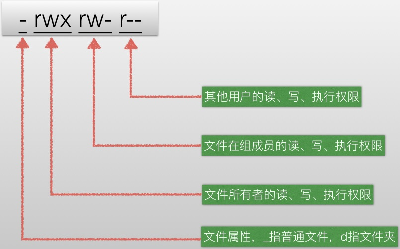

## 一、 进程管理

### 问：Linux进程间的通信方式

Linux进程间通信方式有：消息队列，命名管道，信号量，共享内存，套接字等，临界区不能用于Linux中的进程间通信。

https://www.nowcoder.com/profile/7404313/test/8067759/1034?onlyWrong=0

### 问：终止一个前台进程可能用到的命令和操作

终止一个前台进程用Ctrl+C；

暂停一个前台进程用Ctrl+Z；

终止一个后台进程：

- 使用kill命令；
- 或使用fg命令将后台进程变为前台进程，然后Ctrl+C。

### 问：ps

### 问：jobs 

显示系统进程

## 二、 存储管理

### 问：free

free是系统自带的、常用的监控工具，用于显示已使用物理内存和交换空间，相对于top命令，free可以更简洁的查看内存的使用情况。

## 三、 文件管理

### 问：Linux文件目录

/bin  二进制执行文件，也就是命令文件

/etc 下存放的是配置文件

/dev 存放是时外部设备文件，硬盘，usb等

/lib 存放的是库文件

### 问：常用文件介绍
- **/etc/resolv.conf** 
	DNS解析的设置文件
- **/etc/dhcpd.conf**
	DHCP的设置文件
- **/etc/gateways**
	网络路由的设置文件
- **/etc/mail.rc**
	邮件服务的设置文件
- **/etc/hosts**
	hosts文件是Linux系统上一个负责ip地址与域名快速解析的文件，以ascii格式保存在/etc/目录下。hosts文件包含了ip地址与主机名之间的映射，还包括主机的别名。在没有域名解析服务器的情况下，系统上的所有网络程序都通过查询该文件来解析对应于某个主机名的ip地址，否则就需要使用dns服务程序来解决。通过可以将常用的域名和ip地址映射加入到hosts文件中，实现快速方便的访问。
- **/etc/hostname**
	主机名设置文件
- **/proc/interrupts**
	显示使用的中断
- **/proc/ioports**
	当前使用的I/O端口
- **/proc/kcore**
	系统物理内存映像。与物理内存大小完全一样，但不实际占用这么多的内存。
- **/proc/kmsg**
	内核输出的消息，也被送到syslog

https://www.nowcoder.com/profile/7404313/test/8148327/26137?onlyWrong=0

### 问：文件复制

(1) cp命令：cp命令用于复制文件或目录。

	将文件file1复制成文件file2命令如下：cp file1 file2

(2) cat命令 ：cat命令是linux下的一个文本输出命令，通常是用于观看某个文件的内容的。
	
	一次显示整个文件命令如下： cat filename

- > : linux中的数据流重导向：输出导向，覆盖导向的文件内容。
- < : linux中的数据流重导向：输入导向，理解为原本由键盘输入改为文本输入

(3) dd命令 : 作用是用指定大小的块拷贝一个文件，并在拷贝的同时进行指定的转换。

	参数：if 输入文件(或设备名称)  of 输出文件(或设备名称)
	将文件file1拷贝到文件file2中命令如下：  dd if=file1 of=file2

(4) | ：管道命令操作符，处理经由前面一个指令传出的正确输出信息，然后，传递给下一个命令，作为标准的输入

<a href="https://www.nowcoder.com/profile/7404313/test/8322129/3744?onlyWrong=0" title="Title">例1：</a>

	将文件file1复制为file2可以使用的命令：
	cp file1 file2
	cat file1 >file2
	cat < file1 >file2
	dd if=file1 of=file2
	cat file1 | cat >file2

### 问：Linux文件权限

Linux文件权限的长度为10位，分成四段：文件类型(1位) + 拥有者权限(3位) + 所属组权限(3位) + 其他用户权限(3位)

### 问：chmod 修改文件权限

	chmod [who] [+|-|=][mode] 文件名

(1) [who]的取值可以为u，g，o和a，

- u 表示"用户(user)"，即文件拥有者；
- g 表示"同组(group)用户"，即与文件拥有者有相同组ID的所有用户；
- o 表示"其他(others)用户"；
- a 表示"所有(all)用户"，它是系统默认值。

(2) [+|-|=]

- \+ 添加某个权限；
- - 取消某个权限；
- = 赋予给定权限并取消其他所有权限（如果有的话）。 

(3) [mode]

- 当使用+或-时，权限从0到7的一个八进制数，例如7为4+2+1的组合，代表可读可写可执行权限；5为4+1的组合，代表可读可执行，等；
- 当使用=时，权限为从0到7的3个八进制数，按(u)、(g)、(o)顺序组织，分别对应文件拥有着、同组用户和其他用户的权限。

<a href="https://www.nowcoder.com/profile/7404313/test/8148327/23228?onlyWrong=0" title="Title">例1：</a>

	文件file的访问权限为rw-r--r--，现要增加所有用户的执行权限和同组用户的写权限，其命令可以为：chmod a+x,g+w file 或 chmod 764 file

注意为多种用户设置权限时，中间以","隔开，不可以加空格。如chmod a+x, g+w file为错误形式，逗号后面存在空格。

<a href="https://www.nowcoder.com/profile/7404313/test/8148327/50976?onlyWrong=0" title="Title">例2：</a>

	现在file文件的权限改为只有拥有着拥有执行权限的命令可以为：chmod u+x,g-x,o-x file 或 chmod 100 file

<a href="https://www.nowcoder.com/profile/7404313/test/8322129/2914" title="Title">例3：</a>

	在unix系统下执行chmod 753 file之后，该文件sample的访问权限为：拥有者可读写执行，同组用户可读可执行，其他用户可写可执行

### 问：umask

	umask [-p] [-S] [mode]

umask可用来指定在建立文件时预设的权限掩码。对于每一类用户(文件属主、同组用户、其他用户)在umask值mode中都存在一个相应的数字。

- 对于文件来说，这一数字的最大值是6。系统不允许你在创建一个文本文件时就赋予它执行权限，必须在创建后用chmod命令增加这一权限；
- 目录则允许设置执行权限，这样针对目录来说，umask中各个数字最大可以为7。

<a href="https://www.nowcoder.com/profile/7404313/test/7907952/15820?onlyWrong=0" title="Title">例1：</a>

	如果系统的umask设置为244，创建一个新文件后，它的权限为：-r---w--w-

	创建时，文件权限默认为666，目录权限默认777，减去umask的位就是结果权限。因此该文件权限为666-244=422，即为-r---w--w-

<a href="https://www.nowcoder.com/profile/7404313/test/8322129/14511?onlyWrong=0" title="Title">例2：</a>

	设umask为002, 则新建立的文件的权限是：-rw-rw-r--

### 问：tar 压缩和解压缩

tar [必选项+可选项] 文件或者目录

必选项：

- -c 创建压缩包；
- -x 解开压缩包；
- -t 列出包中的内容；
- -r 增加文件到指定包中；
- -u 更新包中的文件

可选项：

- -j 创建或解开压缩包包时使用bzip2进行压缩或解压缩；
- -z 创建或解开压缩包包时使用gzip进行压缩或解压缩；
- -Z 创建或解开压缩包包时使用compress进行压缩或解压；
- -f 后面跟指定的压缩包文件名；
- -v 显示创建压缩包/解开压缩包的过程；
- -C 指定解开压缩包的路径

<a href="https://www.nowcoder.com/profile/7404313/test/8322129/14711?onlyWrong=0" title="Title">例1：</a>

	在linux中如何使用tar命令将文件aaa打包为bak.tar：tar -cf bak.tar aaa

<a href="https://www.nowcoder.com/profile/7404313/test/8114836/14346?onlyWrong=0" title="Title">例2：</a>

	tar命令用于解压的参数是: -x

## 四、 网络管理

### 问：ping 测试连通性

ping命令用来测试主机之间网络的连通性，底层是ICMP协议。

主机发出ICMP报文后，若主机与目的主机之间的网络连通正常，则目的主机会返回响应报文。

我们经常会说"ping一下某机器，看是不是开着"、不能打开网页时会说"你先ping网关地址192.168.1.1试试"。它通过发送ICMP ECHO\_REQUEST数据包到网络主机，并显示响应情况，这样我们就可以根据它输出的信息来确定目标主机是否可访问(但这不是绝对的)。有些服务器为了防止通过ping探测到，通过防火墙设置了禁止ping或者在内核参数中禁止ping，这样就不能通过ping确定该主机是否还处于开启状态。

### 问：traceroute 路径跟踪

traceroute是常用的路由查看命令，用来追踪数据包到达网络上某个主机在时经过的路径

### 问：route 查看路由表

route命令用来显示目前本机路由表的内容，并且还可以针对路由表中的记录进行相应的添加、删除或修改等操作。

(1) route print 本命令用于显示路由表中的当前项目，由于用IP地址配置了网卡，因此所有的这些项目都是自动添加的。 

(2) route add 本命令可以将新路由项目添加到路由表。

(3) route change 使用本命令可以修改数据的传输路由，不过，你不能使用本命令来改变数据的目的地。 

(4) route delete 使用本命令可以从路由表中删除路由。

<a href="https://www.nowcoder.com/profile/7404313/test/8322129/22105?onlyWrong=0" title="Title">例1：</a>

	局域网的网络地址192.168.1.0/24，局域网络连接其它网络的网关地址是192.168.1.1。
	主机192.168.1.20访问172.16.1.0/24网络时，其路由设置正确的是：route add –net 172.16.1.0 gw 192.168.1.1 netmask 255.255.255.0 metric 1

	路由信息是由{目的主机所在的网络地址，下一跳地址，子网掩码}组成，-net 后面跟的是目的网络，下一跳的地址就是局域网中连接外网的网关地址

### 问：ifconfig

ifconfig命令用来查看活动的网卡信息

### 问：telnet

telnet命令通常用来进行远程登录。telnet程序是基于TELNET协议的远程登录客户端程序。Telnet协议是TCP/IP协议族中的一员，是Internet远程登录服务的标准协议和主要方式。它为用户提供了在本地计算机上完成远程主机工作的能力。

### 问：netstat

netstat命令用于显示与IP、TCP、UDP和ICMP协议相关的统计数据，一般用于检验本机各端口的网络连接情况。 netstat是在内核中访问网络及相关信息的程序，它能提供TCP连接，TCP和UDP监听，进程内存管理的相关报告。 如果你的计算机有时候接收到的数据报导致出错数据或故障，你不必感到奇怪，TCP/IP可以容许这些类型的错误，并能够自动重发数据报。但如果累计的出错情况数目占到所接收的IP数据报相当大的百分比，或者它的数目正迅速增加，那么你就应该使用 netstat查一查为什么会出现这些情况了。

### 问：tcpdump

https://www.nowcoder.com/profile/7404313/test/8322129/14462?onlyWrong=0

## 五、 用户管理

## 六、 系统管理

### 问：uptime

uptime命令主要用于获取主机运行时间和查询linux系统负载等信息

### 问：top

### 问：sar

### 问：Linux关机命令

- halt init 0 
- poweroff   
- shutdown -h 时间 (例如，shutdown -h now)

### 问：Linux重启命令

- reboot
- init 6
- shutdown -r 时间

## 七、 内核管理

## 八、 帮助文档

### 问：man 查看Linux命令手册

<a href="https://www.nowcoder.com/profile/7404313/test/8322129/2914" title="Title">例1：</a>

	命令man 5 passwd的作用：显示password文件的格式描述

## 九、 其他

### 问：查看相关信息

- cat /proc/meminfo 查看物理内存的信息

### 问：常用命令介绍

- **grep**
- **netstat**
	netstat命令用来查看本机的传输层连接状态，如TCP、UDP连接，端口等信息

- **tcpdump**
	tcpdump是简单可靠网络监控的实用工具
- **top**
	top命令是Linux下常用的性能分析工具，能够实时显示系统中各个进程的资源占用状况
- **fg**
	将一个后台进程调至前台继续运行
- **bg**
	将一个在后台暂停的进程唤醒，继续执行
- **ctrl+z**
	可以将一个正在前台执行的进程放到后台，并且暂停，表示进程被挂起

- **dpkg**
	"dpkg"是"Debian Packager"的简写，是为"Debian"专门开发的套件管理系统，方便软件的安装、更新及移除。所有源自"Debian"的"Linux "发行版都使用"dpkg"，例如"Ubuntu"、"Knoppix"等。示例：dpkg -i avg71flm_r28-1_i386.deb
- **df**
	df命令用于显示磁盘分区上的可使用的磁盘空间。默认显示单位为KB。可以利用该命令来获取硬盘被占用了多少空间，目前还剩下多少空间等信息。 

https://www.nowcoder.com/profile/7404313/test/8078490/55441?onlyWrong=0

### 问：grep和find

find是根据文件名进行查找，grep是对文件的内容进行搜索

https://www.nowcoder.com/profile/7404313/test/8114836/14452?onlyWrong=0

### 问：sed

https://www.nowcoder.com/profile/7404313/test/8114836/14510?onlyWrong=0

### 问：

init命令是进程和作业管理命令，init命令是Linux下的进程初始化工具，init进程是所有Linux进程的父进程，它的进程号为1。init命令是 Linux操作系统中不可缺少的程序之一，init进程是Linux内核引导运行的，是系统中的第一个进程。

### 问：mount

查看磁盘挂载状态

### 问：mkdir

https://www.nowcoder.com/profile/7404313/test/8114836/23226?onlyWrong=0

### 问：usermod 

https://www.nowcoder.com/profile/7404313/test/8114836/22122?onlyWrong=0

### 问：crontab，定时任务

通过crontab 命令，我们可以在固定的间隔时间执行指定的系统指令或 shell script脚本，该命令前五个域是指定命令被执行的时间，最后一个域是要被执行的命令，每个域之间使用空格或者制表符分隔。

	格式如下： minute hour day-of-month month-of-year day-of-week command

这些项都不能为空，必须填入。如果用户不需要指定其中的几项，那么可以使用\*代替。因为*是统配符，可以代替任何字符，所以就可以认为是任何时间，也就是该项被忽略了。

	第1列表示分钟(1～59)，每分钟用*或者*/1表示
    第2列表示小时(1～23，0表示0点)
	第3列表示日期(1～31)
	第4列表示月份(1～12)
    第5列标识号星期(0～6，0表示星期天) 
	第6列要运行的命令

	例如：*/5 * * * * exam，表示每5分钟运行一次任务exam。

### 问：Linux下的输入/输出重定向

在Linux中，每个打开的文件被赋予一个文件描述符(file descriptor)，包括标准输入(stdin)，标准输出(stdout)和标准错误输出(stderr)，分别由0，1，2描述。

command &> file 表示将标准输出(stdout)和标准错误输出(stderr)重定向至指定的文件file中

command > file 2>&1，是由两部分组成。首先command>file表示将标准输出(stdout)重定向到文件file中。接下来的2>&1表示将标准错误输出(stderr)输出到文件描述符1指定的位置，即标准输出(stdout)的位置，由于标准输出已经冲定向到文件file中，所以标准错误输出也会重定向到文件file中。

### 问：Shell命令

https://www.nowcoder.com/profile/7404313/test/8114836/14919?onlyWrong=0

### 问：硬链接和软链接

https://www.nowcoder.com/profile/7404313/test/8114836/36414?onlyWrong=0

### 问：Linux内存划分

https://www.nowcoder.com/profile/7404313/test/8114836/25177?onlyWrong=0

### 问：Nginx

https://www.nowcoder.com/profile/7404313/test/8114836/26093?onlyWrong=0

### 问：fork

https://www.nowcoder.com/profile/7404313/test/8114836/14836?onlyWrong=0

### grep

	统计一个文件中"牛客"出现的行数: grep "牛客" 文件名 | wc -l

https://www.nowcoder.com/profile/7404313/test/8148327/22524?onlyWrong=0

### find

https://www.nowcoder.com/profile/7404313/test/8148327/25705?onlyWrong=0

### 孤儿进程、僵尸进程

https://www.nowcoder.com/profile/7404313/test/8148327/14857?onlyWrong=0

https://www.nowcoder.com/profile/7404313/test/8148327/25761?onlyWrong=0

### 管道通信

https://www.nowcoder.com/profile/7404313/test/8322129/36306?onlyWrong=0

###　makefile

https://www.nowcoder.com/profile/7404313/test/8322129/15416?onlyWrong=0