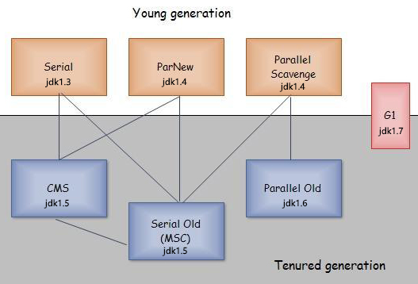

## 一、 Java概述

### 问：什么是Java虚拟机？为什么Java被称作是“平台无关的编程语言”？

Java源文件被javac编译成能被Java虚拟机执行的.class字节码文件，Java虚拟机是一个可以执行Java字节码的虚拟机进程，它拥有自己完善的硬体架构，如堆栈、寄存器，还具有相应的指令系统。

Java虚拟机对开发者屏蔽了与具体操作系统平台相关的信息，使得Java源文件只需要被编译成可以在JVM上运行的字节码文件，就可以由**相应平台的虚拟机**在具体平台上解释运行，从而实现一次编译，处处执行。这样，Java被设计成允许应用程序可以运行在任意的平台上，而不需要程序员为每一个平台单独重写或者是重新编译。

### 问：动态语言和静态语言

动态语言：运行时执行类型检查，如PHP、Ruby、Python等。

静态语言：编译时执行类型检查，如C、C++、Java和C#等。

### 问：编译型语言和解释型语言

https://www.nowcoder.com/profile/7404313/test/8049404/3231?onlyWrong=0

### 问：Java运行时数据区

Java运行时数据区包括：虚拟机栈区，堆区，方法区，本地方法栈，程序计数器

- 虚拟机栈区：也就是我们常说的栈区，**线程私有**，在编译期间完成分配，为虚拟机执行Java方法(也就是字节码)服务，每个方法在执行时会创建一个栈帧用于存放局部变量表、操作数栈、动态链接和方法出口等信息，每个方法的调用直至执行完成对应于栈帧的入栈和出栈；

- 堆区：JAVA堆，也称GC堆，在JVM启动时创建，**所有线程共享**，存放对象的实例和数组，是垃圾收集器管理的主要区域。"GC堆"，可以细分为新生代和老年代，新生代又可以细分为Eden空间、From Survivor空间和To Survivor空间；物理上可以不连续，但逻辑上连续，可以选择固定大小或者扩展。

- 方法区：**所有线程共享**，用于存储被虚拟机加载的类信息、常量、静态变量、即时编译器编译后的代码等数据。这个区域的内存回收目标主要是针对常量池中的对象的回收和堆类型的卸载。方法区被称为“永久代”，是因为HotSpot虚拟机的设计团队把GC分代收集扩展到方法区，即使用永久代来实现方法区，像GC管理Java堆一样管理方法区，从而省去专门为方法区编写内存管理代码，

- 本地方法栈(Native Method Stacks)：**线程私有**，与虚拟机栈所发挥的作用是非常相似的，其区别不过是虚拟机栈为虚拟机执行Java方法(也就是字节码)服务，而本地方法栈则是为虚拟机使用到的Native方法服务。虚拟机规范中对本地方法栈中的方法使用的语言、使用方式与数据结构并没有强制规定，因此具体的虚拟机可以自由实现它。甚至有的虚拟机（譬如Sun HotSpot虚拟机）直接就把本地方法栈和虚拟机栈合二为一。与虚拟机栈一样，本地方法栈区域也会抛出StackOverflowError和OutOfMemoryError异常。

- 程序计数器：**线程私有**，每个线程都有自己独立的程序计数器，用来指示下一条指令的地址，是当前线程所执行的字节码的行号指示器，如果线程正执行一个java方法，计数器记录下一条执行的虚拟机字节码指令的地址；如果线程正在执行的是Native方法，则计数器值为空；

- 运行时常量池：**线程共享**，是方法区的一部分，存放编译期Class文件中生成的各种字面量和符号引用。

https://www.nowcoder.com/profile/7404313/test/8045843/14817?onlyWrong=0

### 问：堆和栈的区别

栈内存由操作系统来分配，只要栈剩余空间大于所申请空间，系统将为程序提供内存，否则将报异常提示栈溢出

堆内存由程序员自己来申请分配

https://www.nowcoder.com/profile/7404313/test/8045843/23410?onlyWrong=0

### 问：Java堆的结构是什么样子的？什么是堆中的永久代(Perm Gen space)? 需要整理使答案更简洁

JVM的堆是运行时数据区，所有类的实例和数组都是在堆上分配内存。它在JVM启动的时候被创建。对象所占的堆内存是由自动内存管理系统也就是垃圾收集器回收。

堆内存是由存活和死亡的对象组成的。存活的对象是应用可以访问的，不会被垃圾回收。死亡的对象是应用不可访问尚且还没有被垃圾收集器回收掉的对象。一直到垃圾收集器把这些对象回收掉之前，他们会一直占据堆内存空间。

虚拟机中的堆内存共划分为三个代：**年轻代（Young Generation）、年老代（Old Generation）和持久代（Permanent Generation）**。其中持久代主要存放的是Java类的类信息，与垃圾收集要收集的Java对象关系不大。年轻代和年老代的划分是对垃圾收集影响比较大的。

Java的垃圾收集机制主要针对新生代和老年代的内存进行回收，不同的垃圾收集算法针对不同的区域。所以java的垃圾收集算法使用的是分代回收。一般java的对象首先进入新生代的Eden区域，当进行GC的时候会回收新生代的区域，新生代一般采用复制收集算法，将活着的对象复制到survivor区域中，如果survivor区域装在不下，就查看老年代是否有足够的空间装下新生代中的对象，如果能装下就装下，否则老年代就执行FULL GC回收自己，老年代还是装不下，就会抛出OUtOfMemory的异常。

(1) **年轻代**:所有新生成的对象首先都是放在年轻代的。年轻代的目标就是尽可能快速的收集掉那些生命周期短的对象。Minor GC是针对新生代的回收。

年轻代分三个区:一个Eden区，两个Survivor区(一般而言)。

大部分对象在Eden区中生成。当Eden区满时，还存活的对象将被复制到Survivor区(两个中的一个)，当这个Survivor区满时，此区的存活对象将被复制到另外一个Survivor区，当这个Survivor去也满了的时候，从第一个Survivor区复制过来的并且此时还存活的对象，将被复制“年老区(Tenured)”。需要注意，Survivor的两个区是对称的，没先后关系，所以同一个区中可能同时存在从Eden复制过来对象，和从前一个Survivor复制过来的对象，而复制到年老区的只有从第一个Survivor去过来的对象。而且，Survivor区总有一个是空的。同时，根据程序需要，Survivor区是可以配置为多个的（多于两个），这样可以增加对象在年轻代中的存在时间，减少被放到年老代的可能。
  
(2) **年老代**:在年轻代中经历了N次垃圾回收后仍然存活的对象，就会被放到年老代中。因此，可以认为年老代中存放的都是一些生命周期较长的对象。Major GC/Full GC是针对年老代的回收。
  
(3) **持久代**:用于存放静态文件，如类、方法、final常量、static变量等。持久代对垃圾回收没有显著影响，但是有些应用可能动态生成或者调用一些class，例如Hibernate等，在这种时候需要设置一个比较大的持久代空间来存放这些运行过程中新增的类。持久代大小通过-XX:MaxPermSize=<N>进行设置。

https://www.nowcoder.com/profile/7404313/test/7932407/50975?onlyWrong=0

https://www.nowcoder.com/profile/7404313/test/7945971/36411?onlyWrong=0

https://www.nowcoder.com/profile/7404313/test/7964595/14849?onlyWrong=0

### 问：JVM内存配置参数

	-Xmx：最大堆大小
	-Xms：初始堆大小
	-Xmn:年轻代大小
	-XXSurvivorRatio：年轻代中Eden区与Survivor区的大小比值

案例：

	当-Xmx10240m -Xms10240m -Xmn5120m -XXSurvivorRatio=3时，其最小内存值和Survivor区总大小分别是()

	-Xms初始堆大小即最小内存值，即最小内存值为10240m
	JVM一般根据对象的生存周期将堆内存分为若干不同的区域，一般情况将新生代分为Eden，两块Survivor；
	由-XXSurvivorRatio=3可知Eden:Survivor=3，年轻带总大小为5120m，那么Survivor区总大小为2048m

### 问：Java中垃圾回收(GC)有什么目的？什么时候进行垃圾回收？

GC是垃圾收集的意思(Gabage Collection)，内存处理是编程人员容易出现问题的地方，忘记或者错误地内存回收会导致程序或系统的不稳定甚至崩溃，Java提供的GC功能可以自动监测对象是否超过作用域从而达到自动回收内存的目的。

垃圾回收的目的是**识别并回收堆内存**中不再使用的对象所占的内存，释放资源。而栈区的内存是随着线程结束而释放的。

触发主GC(Garbage Collector，垃圾回收)的条件：

(1) 当应用程序空闲时，即没有应用线程在运行时，GC会被调用。

(2) Java堆内存不足时，GC会被调用。

### 问：System.gc()和Runtime.gc()会做什么事情？

Java提供了垃圾回收机制来帮助我们不定时的回收堆中不再使用的对象。当JVM启动时，除了启动我们的主线程外，还会启动垃圾回收线程，它运行优先非常低，会在JVM空闲时，自动回收我们不再使用的对象，释放内存空间。

程序员不能强制执行垃圾回收，可以用这两个方法用来提示JVM要进行垃圾回收。但是，立即开始还是延迟进行垃圾回收是取决于JVM，即垃圾回收的具体时间和顺序是无法预知的。

https://www.nowcoder.com/profile/7404313/test/8078128/50975?onlyWrong=0

### 问：垃圾回收器的演化

图 1

#### 38. 如果对象的引用被置为null，垃圾收集器是否会立即释放对象占用的内存？

不会立即释放对象占用的内存，如果对象的引用被置为null，只是断开了当前线程栈帧中对该对象的引用关系，在下一个垃圾回收周期中，这个对象将是可被回收的。

#### 40. 串行(serial)收集器和吞吐量(throughput)收集器的区别是什么？

吞吐量收集器使用并行版本的新生代垃圾收集器，它适合于吞吐量要求较高的场合，用于中等规模和大规模数据的应用程序。

串行收集器整个扫描和复制过程均采用单线程的方式，相对于吞吐量GC来说简单；适合于单CPU、客户端级别。串行对大多数的小应用(在现代处理器上需要大概100M左右的内存)就足够了。

#### 41. 在Java中，对象什么时候可以被垃圾回收？

当对象对当前使用这个对象的应用程序变得不可触及的时候，这个对象就可以被回收了。

#### 42. JVM的永久代中会发生垃圾回收么？(没看懂)

垃圾回收不会发生在永久代，如果永久代满了或者是超过了临界值，会触发完全垃圾回收(Full GC)。如果你仔细查看垃圾收集器的输出信息，就会发现永久代也是被回收的。这就是为什么正确的永久代大小对避免Full GC是非常重要的原因。

请参考下Java8：从永久代到元数据区(注：Java8中已经移除了永久代，新加了一个叫做元数据区的native内存区)

### 问：内存泄漏

内存泄露(Memory Leak)是指一个不再被使用的对象或者变量还在内存中占有存储空间。在C/C++语言中，内存泄露出现在开发人员忘记释放已分配的内存就会造成内存泄露。在java语言中引入垃圾回收机制，有GC负责进行回收不再使用的对象，释放内存。但是还是会存在内存泄露的问题。

**内存泄露主要有两种情况**

(1) 在堆中申请的空间没有释放。

(2) 对象已不再被使用(注意：这里的不再被使用是指对程序来说没有用处，如数据库连接使用后没有关，但是还是存在着引用)，但是仍然在内存中保留着。

GC机制的引入只能解决第一种情况，对于第2种情况无法保证不再使用的对象会被释放。java语言中的内存泄露主要指第2种情况。

**内存泄露的原因**

(1) 静态集合类。如HashMap和Vector。这些容器是静态的，生命周期和程序的生命周期一致，那么在容器中对象的生命周期也和其一样，对象在程序结束之前将不能被释放，从而会造成内存泄露。

(2) 各种连接。如数据库连接，网络连接，IO连接，不再使用时如果连接不释放容易造成内存泄露。

(3) 监听器。释放对象时往往没有相应的删除监听器，可能会导致内存泄露。

内存溢出（OOM）是指程序在申请内存时没有足够的内存供使用，进而导致程序崩溃这是结果描述。内存泄露（Memory Leak）最终会导致内存溢出。

### 问：JDK和JRE的区别是什么？

Java运行时环境(JRE)包括Java虚拟机、Java核心类库和支持文件，JVM对Java字节码文件进行解释执行。只有JRE只能执行Java程序，不能进行java程序的开发。

Java开发工具包(JDK)是完整的Java软件开发包，包含了JRE，编译器和其他的工具(比如：JavaDoc，Java调试器)，可以让开发者开发、编译、执行Java应用程序。

1.	一个".java"源文件中是否可以包括多个类（不是内部类）？有什么限制？
可以。如果这个类的修饰符是public，其类名与文件名必须相同。

1.	JAVA的事件委托机制和垃圾回收机制
java 事件委托机制的概念,一个源产生一个事件并将它送到一个或多个监听器那里。在这种方案中，监听器简单的等待，直到它收到一个事件。一旦事件被接受，监听器将处理这个事件，然后返回。
垃圾回收机制 垃圾收集是将分配给对象但不再使用的内存回收或释放的过程。如果一个对象没有指向它的引用或者其赋值为null,则此对象适合进行垃圾回收

### 问：

https://www.nowcoder.com/profile/7404313/test/8078128/56325?onlyWrong=0

### javac

https://www.nowcoder.com/profile/7404313/test/8078128/973?onlyWrong=0
