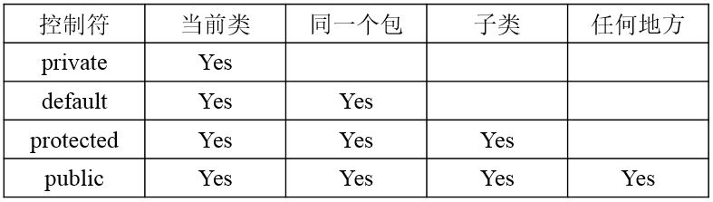
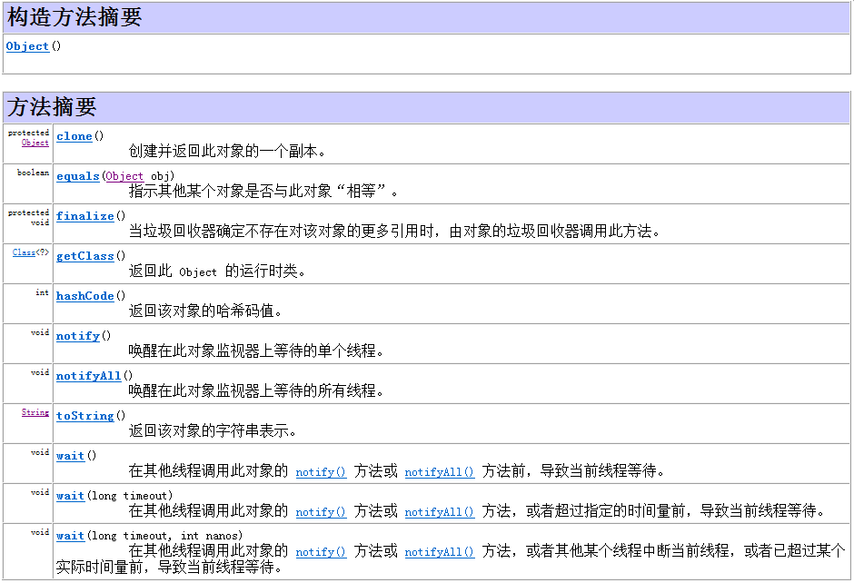

## 三、 面向对象编程

#### 问：面向对象的基本特征  

(1) 封装：一个类包括多个属性及方法。

(2) 继承：子类继承于父类，具有父类的所有属性与方法，可以重用，也可以覆盖。 

(3) 多态：

### 问：类

<a href="https://www.nowcoder.com/profile/7404313/test/8066549/979?onlyWrong=0" title="Title">例1：</a>

### 问：访问控制符

Java类的成员默认为default访问权限。

图 1

访问权限大小：public>protected>default>private

<a href="https://www.nowcoder.com/profile/7404313/test/8078128/56331?onlyWrong=0" title="Title">例1：</a>

### 问：Java中，什么是构造方法？什么是构造方法重载？什么是复制构造方法？

Java中每一个类都有构造方法，当使用关键字new实例化一个对象时，类的构造方法就会被自动调用，完成对象的初始化工作。

构造方法是一种特殊的方法，具有以下特点:

(1) 构造方法的方法名必须与类名相同；

(2) 构造方法没有返回值类型，也不能定义为void；

(3) 构造方法不能被static、final、synchronized、abstract、native等关键字修饰，但可以被public、private、protected修饰

(4) 一个类可以定义多个构造方法，如果在定义类时没有定义构造方法，则编译系统会自动插入一个无参数的默认构造方法，这个构造器不执行任何代码；

<a href="https://www.nowcoder.com/profile/7404313/test/8070641/56330" title="Title">例1：</a>

(5) 构造方法可以被重载，以参数的个数、类型、顺序进行区分；

(6) 构造方法不能被继承，因此不能被重写，子类使用父类的构造方法需要使用super关键字

<a href="https://www.nowcoder.com/profile/7404313/test/8066549/25830?onlyWrong=0" title="Title">例1：</a>

Java中构造方法重载和方法重载很相似，可以为一个类创建多个构造方法，每一个构造方法必须有它自己唯一的参数列表。

Java不支持像C++中那样的复制构造方法，但是这并不代表Java中没有这种机制，Java中Object类的clone()方法就是这种机制的体现。

### 问：new关键字

<a href="https://www.nowcoder.com/profile/7404313/test/8049404/56502?onlyWrong=0" title="Title">例1：</a>

### 问：this关键字

### 问：static关键字

"static"关键字可以用于修饰类的成员变量和成员方法，被其修饰的成员变量被称为类变量，被其修饰的成员方法成为类方法，它们随着类的加载而加载，使得该变量和方法可以在类没有实例化的情况下可以直接通过类名进行访问。

(1) 被static修饰的成员方法只能访问static成员，不可以访问非static成员

Java中被static修饰的变量和方法是属于类的，它们随着类的加载而加载，同时对static变量进行初始化并执行static代码块。如果static环境中的代码尝试访问非static的变量，编译器会报错，因为**类的加载先于变量的创建，类加载的时候这些变量还没有被创建出来**，例如，在static方法中访问某对象的非static方法，此时尚不能保证对象已经被实例化。因此在static环境中不能访问非static变量。

<a href="https://www.nowcoder.com/profile/7404313/test/7958772/56439?onlyWrong=0" title="Title">例1：</a>

(2) Java中静态变量只能在类主体中定义，不能在方法中定义。

 静态变量属于类所有而不属于方法。静态变量是在方法之前被加载的，所以static变量只能是类成员变量，而不能是局部变量，因为在static加载时，方法还没有分配空间。
 
<a href="https://www.nowcoder.com/profile/7404313/test/8109636/56377?onlyWrong=0" title="Title">例1：</a>

	public class Test {
		public int aMethod() {
			static int i = 0;
			i++;
			return i;
		}
		public static void main (String args[]) {
			Test test = new Test();
			test.aMethod();
			int j = test.aMethod();
			System.out.println(j);
		}
	}

	程序编译失败

### 问：继承

继承时类的实例化问题：在实例化一个类时，一定是先创建其父类对象，即先执行父类的构造函数，然后再创建当前类对象。如果子类没有显示地调用父类的构造函数，编译器会自动加入父类的无参的构造函数super()

<a href="" title="Title">例1：</a>

	package test; 
	class FatherClass { 
		public FatherClass() { 
			System.out.println("FatherClass Create"); 
		} 
	} 

	class ChildClass extends FatherClass { 
		public ChildClass() { 
			System.out.println("ChildClass Create"); 
		} 
		public static void main(String[] args) { 
			FatherClass fc = new FatherClass(); 
			ChildClass cc = new ChildClass(); 
		} 
	} 

	程序的输出结果如下：
	FatherClass Create 
	FatherClass Create 
	ChildClass Create

### 问：Java支持多继承么？

Java中的类不支持多继承，只支持单继承(即一个类只有一个父类)。 但是Java中的接口支持多继承，即一个子接口可以有多个父接口。(接口的作用是用来扩展对象的功能，一个子接口继承多个父接口，说明子接口扩展了多个功能，当类实现接口时，类就扩展了相应的功能)。

### 问：super和this

在子类构造方法中，使用super()调用的是其父类的构造方法，而使用this()调用的是同一个类中重载的构造方法

**super关键字**

(1) Java中子类不能继承父类的构造方法，只能调用父类构造方法；

(2) 子类的构造方法可以使用super显示地调用父类构造方法；

(3) 当子类构造方法中没有使用super来显示地调用父类构造方法时，系统会默认采用super()调用父类的无参构造方法，这时父类必须提供无参构造参数，否则编译出错。

案例：
https://www.nowcoder.com/profile/7404313/test/8066549/15538?onlyWrong=0

	https://www.nowcoder.com/profile/7404313/test/7958772/55361?onlyWrong=0

	https://www.nowcoder.com/profile/7404313/test/8049404/15324?onlyWrong=0

**this关键字**

**注意：**

(1) 使用super()或this()时，它们必须放在构造方法的第一行，否则编译通不过。

(2) 由于this()调用的构造函数默认调用super()方法，所以规定this()和super()不能同时出现在一个构造函数中。

(3) static环境，包括static方法和static语句块，在执行时还没有构造对象实例，因此不能在static环境中使用this()和super()

1.	super()与this()的区别？
This（）：当前类的对象,super父类对象。
Super（）：在子类访问父类的成员和行为,必须受类继承规则的约束
而this他代表当前对象,当然所有的资源都可以访问.
在构造函数中,如果第一行没有写super(),编译器会自动插入.但是如果父类没有不带参数的构造函数,或这个函数被私有化了(用private修饰).此时你必须加入对父类的实例化构造.而this就没有这个要求,因为它本身就进行实例化的构造.
而在方法中super和this使用的方法就差不多了.只不过super 要考虑是否能访问其父类的资源.

https://www.nowcoder.com/profile/7404313/test/7977669/22482?onlyWrong=0

### 问：Java中的方法重写(Overriding)和方法重载(Overloading)是什么意思？

方法重写和方法重载都是Java多态性的不同表现(动态绑定 dynamic binding)

(1) 方法重载是一个类中多态性的一种表现，发生在同一个类里面两个或多个方法的方法名相同但是参数列表不同的情况。
> 函数名必须相同；
> 
> 函数参数列表必须不相同，可以是参数个数、参数类型或者参数顺序不同；
> 
> 函数的返回值类型、修饰符可以相同，也可以不相同；

(2) 方法重写是父类与子类之间多态性的一种表现，是说子类重新定义了父类的方法；方法的重写满足两同两小一大原则
> 方法名相同，参数类型相同
> 
> 子类返回类型小于等于父类方法返回类型；
> 
> 子类抛出异常小于等于父类方法抛出异常；
> 
> 子类访问权限大于等于父类方法访问权限 (public>protected>defualt(默认修饰符)>private)。

注意：Java不支持运算符重载。

<a href="https://www.nowcoder.com/profile/7404313/test/7993658/44624?onlyWrong=0" title="Title">例1：</a>

### 问：Java中是否可以覆盖(override)一个private或者是static的方法？

private修饰的方法不能被覆盖，因为被private修饰的父类方法在子类中是不可见的。

Java中静态方法在形式上可以被重写，即子类中可以重写父类中静态的方法。但是实际上从内存的角度上静态方法不可以被重写，因为**方法覆盖是基于运行时动态绑定的，而static方法是编译时静态绑定的**。static方法跟类的任何实例都不相关，所以概念上不适用。

### 问：final关键字

final关键字可以用于修饰类、变量和方法。

(1) final修饰的类不可被继承(因此一个类不能同时被final和abstract修饰)；

(2) final修饰的方法不可被重写；

(3) final修饰的变量的值不可被修改，一旦获得初始值，该变量就不能被重新赋值。

<a href="https://www.nowcoder.com/profile/7404313/test/8070641/15311?onlyWrong=0" title="Title">例1：</a>

<a href="https://www.nowcoder.com/profile/7404313/test/8073294/22481?onlyWrong=0" title="Title">例2：</a>

<a href="https://www.nowcoder.com/profile/7404313/test/8078128/14994?onlyWrong=0" title="Title">例3：</a>

(4) 形式参数只能用final修饰符，任何其它修饰符都会引起编译错误。但是用这个修饰符也有一定的限制，就是在方法中不能对参数做任何修改。不过在一般情况下，一个方法的形参不用final修饰。只有在特殊情况下：方法内部类，一个方法内的内部类如果使用了这个方法的参数或者局部变量，这个参数或局部变量应该是final。

(5) final修饰的成员变量既可以在定义时显示地初始化，也可以先声明而不初始化，这种成员变量称为blank final，此时可以在构造代码块或构造函数中对其赋初值，否则编译会报错。

<a href="" title="Title">例1：</a>

	class Foo {
	    final int i;
	    int j;
	    public void doSomething() {
	        System.out.println(++j + i);  // 编译出错，因为final成员变量在使用前没有赋初值
	    }
	}

<a href="https://www.nowcoder.com/questionTerminal/48f183240e8d4ec3aeecc90337a396a0" title="Title">例2：</a>
这一题解释尚不明确，不知道final方法在子类中继承了没有。

	public class Car extends Vehicle{
		public static void main(String[] args){
			new Car().run();    //输出：Car
		}
		private final void run(){
			System.out.println("Car");
		}
	}
	class Vehicle{
		private final void run(){
			System.out.println("Vehicle");
		}
	}

(6) 被fianl修饰的变量不会自动改变类型，当2个final修饰相操作时，结果会根据左边变量的类型而转化

<a href="https://www.nowcoder.com/profile/7404313/test/8109636/44646?onlyWrong=0" title="Title">例1：</a>

	byte b1=1,b2=2,b3,b6,b8;
	final byte b4=4,b5=6,b7;
	b3=(b1+b2);  /*语句1*/
	b6=b4+b5;    /*语句2*/
	b8=(b1+b4);  /*语句3*/
	b7=(b2+b5);  /*语句4*/
	System.out.println(b3+b6);

	代码片段中，存在编辑错误的语句是：语句1、语句3和语句4
	语句1错误：b3=(b1+b2);自动转为int，所以正确写法为b3=(byte)(b1+b2);或者将b3定义为int；
	语句2正确：b6=b4+b5;b4、b5为final类型，不会自动提升，计算结果任然是byte类型，然后结果的类型视左边变量类型而定，即b6可以是任意数值类型；
	语句3错误：b8=(b1+b4);虽然b4不会自动提升，但b1仍会自动提升，所以结果需要强转，b8=(byte)(b1+b4);
	语句4错误：b7=(b2+b5); 同上。同时注意b7是final修饰，即只可赋值一次，便不可再改变。

### 问：Object类

Java中Object是所有类的祖先类，Object类中包含如下方法：

图 1

### 问：equals()方法和==的区别

- ==运算符：对于基本数据类型变量比较的是两个变量的值是否相等；对于引用型变量表示的是两个变量指向的对象在堆中存储的地址是否相同，即栈中的内容是否相同

- equals()方法：继承自Object类，默认调用==进行比较。判断两个对象是否相等需要覆盖equals()方法和hashcaode()方法

### 37. finalize()方法什么时候被调用？析构函数(finalization)的目的是什么？

finalize()是Object类的一个方法，垃圾回收器(garbage colector)决定回收某对象时，就会运行该对象的finalize()方法。

但是很不幸的是，在Java中，如果内存总是充足的，那么垃圾回收可能永远不会进行，也就是说filalize()可能永远不被执行，显然指望它做收尾工作是靠不住的。 那么finalize()究竟是做什么的呢？它最主要的用途是回收特殊渠道申请的内存。Java程序有垃圾回收器，所以一般情况下内存问题不用程序员操心。但有一种JNI(Java Native Interface)调用non-Java程序（C或C++），finalize()的工作就是回收这部分的内存。

### clone，没遇到过，暂时存放

42、写clone()方法时，通常都有一行代码，是什么？
Clone有缺省行为，super.clone();他负责产生正确大小的空间，并逐位复制。

### 问：多态的实现方式

(1) 静态的多态：方法重载

(2) 动态的多态：子类覆盖父类的方法，将子类的实例赋值给父类的引用，此时调用的是子类的方法；实现接口的实例赋值给接口的引用，此时调用的实现类的方法。

<a href="https://www.nowcoder.com/profile/7404313/test/8049404/14992?onlyWrong=0" title="Title">例1：</a>判断对错

	在java的多态调用中，new的是哪一个类就是调用的哪个类的方法。

	错误	

### 问：抽象类和接口的区别

Java提供和支持创建抽象类和接口。

含有abstract修饰符的class即为抽象类，abstract类不能创建类的实例对象。含有abstract方法的类必须定义为abstract class，abstract class类中定义抽象方法必须在具体(Concrete)子类中实现，所以，不能有抽象构造方法或抽象静态方法。如果的子类没有实现抽象父类中的所有抽象方法，那么子类也必须定义为abstract类型。  

接口(interface)可以说成是抽象类的一种特例

它们的不同点在于：

从设计层面来说，抽象是对类的抽象，是一种模板设计，接口是行为的抽象，是一种行为的规范。

() 抽象类和接口都不可以被实例化

() 抽象类中可以包含普通成员变量、静态成员变量；而接口中没有普通成员变量、只有常量，接口中声明的成员变量默认为public static final类型，且只能是public static final类型；

() 抽象类中可以同时包含抽象方法和非抽象方法，也可以没有抽象方法，但如果一个类中有一个抽象方法，那么当前类一定是抽象类；而接口中只有方法的声明、没有方法体，即接口中的所有方法必须都是抽象的，不能有非抽象的普通方法(Java8中接口可以有非抽象的default方法)

() 抽象类中的抽象方法，需要由子类实现，如果子类不实现所有抽象方法，则子类也需要定义为抽象类；接口中定义的方法都需要由实现类来实现，如果实现类不能实现接口中的所有方法，则实现类需要定义为抽象类

() 抽象类中可以有构造方法，其作用是初始化抽象类的成员；接口中不能有构造方法

() 抽象类中的成员方法的访问类型可以为public、protected和private，抽象方法必须为public或protected；而接口中的成员方法的访问类型默认为public abstract类型，且只能是public abstract

() 抽象类中可以包含静态方法；而接口中不能包含静态方法(Java8开始接口可以有静态方法) 

() 抽象类可以implements接口；接口可以继承接口，并且接口可以实现多继承(一个接口可以继承多个接口)

() 抽象类只能被单一extends(一个类只能继承一个类)；接口却可以被多重implements(一个类可以实现多个接口)

() 类可以不实现抽象类和接口中声明的所有方法，当然，在这种情况下，类也必须得声明成是抽象的

() 抽象方法既不能是static的，也不能是native的，还不能是synchronized的

() 当功能需要累积时用抽象类，不需要累积时用接口

<a href="https://www.nowcoder.com/profile/7404313/test/7906972/15179?onlyWrong=0" title="Title">例1：</a>

<a href="https://www.nowcoder.com/profile/7404313/test/8073294/14303?onlyWrong=0" title="Title">例2：</a>

<a href="https://www.nowcoder.com/profile/7404313/test/8078128/36678?onlyWrong=0" title="Title">例3：</a>

<a href="https://www.nowcoder.com/profile/7404313/test/8100292/15000?onlyWrong=0" title="Title">例4：</a>

### 问：instanceof关键字

https://www.nowcoder.com/profile/7404313/test/7964595/3035?onlyWrong=0

### 问：内部类

https://www.nowcoder.com/profile/7404313/test/8045843/7673?onlyWrong=0

https://www.nowcoder.com/profile/7404313/test/8066549/5120?onlyWrong=0

https://www.nowcoder.com/profile/7404313/test/8073294/4332?onlyWrong=0

### 问Static Nested Class和Inner Class的不同？

Static Nested Class是被声明为静态（static）的内部类，它可以不依赖于外部类实例被实例化。而通常的内部类需要在外部类实例化后才能实例化。 

### 问：类加载器

https://www.nowcoder.com/profile/7404313/test/8004321/36456?onlyWrong=0

### 问：JVM的类加载机制

https://www.nowcoder.com/profile/7404313/test/7977669/26108?onlyWrong=0

https://www.nowcoder.com/profile/7404313/test/8066549/3212?onlyWrong=0

### 问：Java类加载时的初始化顺序
 
(1) 初始化父类中的静态成员变量和静态代码块(按照在程序中出现的顺序初始化)

(2) 初始化子类中的静态成员变量和静态代码块(按照在程序中出现的顺序初始化)

(3) 初始化父类中的普通成员变量和构造代码块(按照在程序中出现的顺序初始化)，然后再执行父类中的构造方法

(4) 初始化子类中的普通成员变量和构造代码块(按照在程序中出现的顺序初始化)，然后再执行子类中的构造方法

<a href="" title="Title">例1：</a>

	class Member {
		Member(String str) {
	        System.out.println(str);
	    }
	}
	class A {
		static {
			System.out.println("父类静态代码块");
		}
		public A() {
			System.out.println("父类构造函数");
		}
		{
			System.out.println("父类构造代码块");
		}
		Member member=new Member("父类成员变量");
	}
	class B extends A {
		Member member=new Member("子类成员变量");
		static {
			System.out.println("子类静态代码块");
		}
		public B() {
			System.out.println("子类构造函数");
		}
		{
			System.out.println("子类构造代码块");
		}
	}
	public class Test{
	    public static void main(String[] args) {
	        new B();
	    }
	}

	//输出：
	父类静态代码块
	子类静态代码块
	父类构造代码块
	父类成员变量
	父类构造函数
	子类成员变量
	子类构造代码块
	子类构造函数

<a href="" title="Title">例2：</a>

	public class B {
		public static B t1 = new B();
		public static B t2 = new B();
		{
			System.out.println("构造块");
		}
		static {
			System.out.println("静态块");
		}
		public static void main(String[] args) {
			B t = new B();
		}
	}
	
	// 输出

	构造块
	构造块
	静态块
	构造块

<a href="https://www.nowcoder.com/profile/7404313/test/7964595/14700?onlyWrong=0" title="Title">例3：</a>

### 问：JNI(Java Native Interface)

https://www.nowcoder.com/profile/7404313/test/7964595/22484?onlyWrong=0

https://www.nowcoder.com/profile/7404313/test/7971730/7665?onlyWrong=0