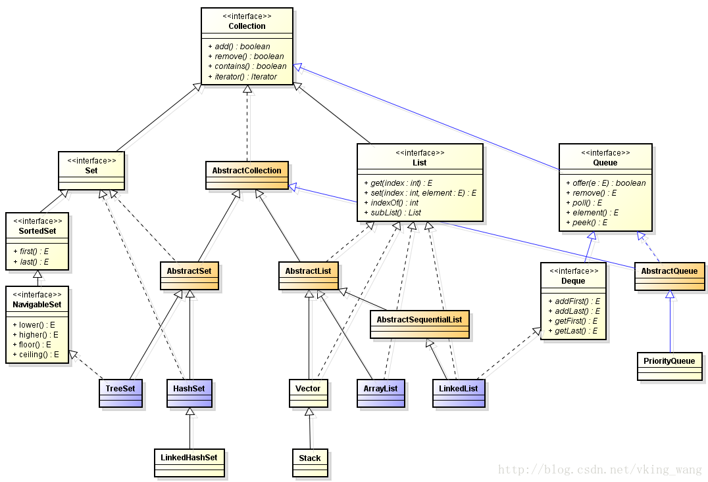
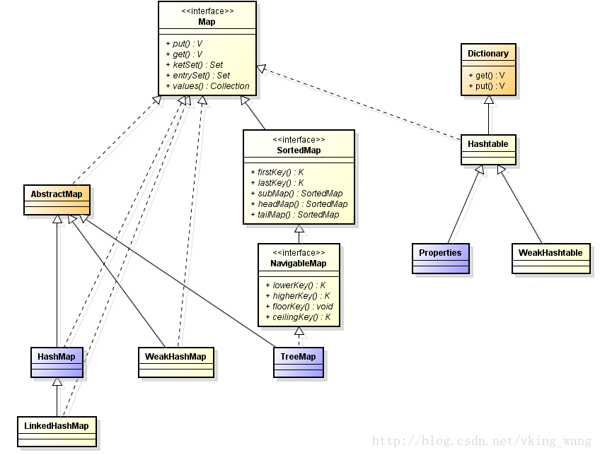

## 七、 容器

### 问：Java的集合类框架

Java集合类提供了一套设计良好的支持对一组对象进行操作的接口和类。集合类接口的每一种具体的实现类都可以选择以它自己的方式对元素进行保存和操作(增、删、改、查)。有的集合类允许重复的键，有些不允许。

Java集合类有两大接口：Collection和Map，一个是元素集合，另一个是键值对集合且键不能重复。

图 1

图 1

- List和Set接口继承了Collection接口，一个是有序元素集合，另一个是无序元素集合；ArrayList和LinkedList实现了List接口，HashSet和TreeSet实现了Set接口，这几个都比较常用；
- HashMap和HashTable实现了Map接口，并且HashTable是线程安全的，但是HashMap性能更好；
- ArrayList和Vector都以数组的方式存储，增、删慢，查、改快；ArrayList:线程不安全，速度快；Vector:线程安全，速度慢；LikedList: 以单链表的方式存储，慢

注意：

Arrays.asList()将一个数组转化为一个List对象，这个方法会返回一个ArrayList类型的对象，这个ArrayList类并非java.util.ArrayList类，而是Arrays类的静态内部类！用这个对象对列表进行添加删除更新操作，就会报UnsupportedOperationException异常。

ConcurrentHashMap使用segment来分段和管理锁，而不是用synchronized

### 问：Java集合框架中线程安全的类

Vector、Stack(它继承了Vector)、Hashtable、Properties、Enumeration、(非集合类的StringBuffer)

### 问：ArrayList和LinkedList有什么区别？

ArrayList和LinkedList都实现了List接口，他们有以下的不同点：

(1) ArrayList是基于索引的数据接口，它的底层是数组。它可以以O(1)时间复杂度对元素进行随机访问。与此对应，LinkedList是以链表的形式存储它的数据，每一个元素都和它的前一个和后一个元素链接在一起，在这种情况下，查找某个元素的时间复杂度是O(n)。

(2) 相对于ArrayList，LinkedList的插入、添加、删除操作速度更快，因为当元素被添加到集合任意位置的时候，不需要像数组那样重新计算大小或者是更新索引。

(3) LinkedList比ArrayList更占内存，因为LinkedList为每一个节点存储了两个引用，一个指向前一个元素，一个指向下一个元素。

### 问：数组(Array)和列表(ArrayList)的区别？什么时候应该使用Array而不是ArrayList？

(1) Array可以包含基本类型和对象类型，ArrayList只能包含对象类型。(但是需要注意的是：Array数组在存放的时候一定是同种类型的元素；ArrayList就不一定了，因为ArrayList可以存储Object。)

(2) Array大小是固定的，ArrayList的大小是动态变化的。

(3) ArrayList提供了更多的方法和特性，比如：addAll()，removeAll()，iterator()等等。

对于基本类型数据，ArrayList使用自动装箱来减少编码工作量。但是，当处理固定大小的基本数据类型的时候，这种方式相对比较慢。

### 问：ArrayList容量

ArrayList的构造函数总共有三个

- ArrayList()构造一个初始容量为 10 的空列表，动态增长时，容量增长到当前容量的1.5倍

- ArrayList(Collection<? extends E> c)
构造一个包含指定collection的元素的列表，这些元素是按照该collection的迭代器返回它们的顺序排列的。

- ArrayList(int initialCapacity)构造一个具有指定初始容量的空列表。

### 问：快速失败(fail-fast)和安全失败(fail-safe)的区别是什么？

快速失败：当你在迭代一个集合的时候，如果有另一个线程正在修改你正在访问的那个集合时，就会抛出一个ConcurrentModification异常。

安全失败：你在迭代的时候会对底层集合做一个拷贝，所以有另一个线程在修改上层集合的时候，访问是不会受影响的，不会抛出ConcurrentModification异常。

> Iterator的安全失败是基于对底层集合做拷贝，因此，它不受源集合上修改的影响。
> 
> java.util包下面的所有的集合类都是快速失败的，而java.util.concurrent包下面的所有的类都是安全失败的。
> 
> 快速失败的迭代器会抛出ConcurrentModificationException异常，而安全失败的迭代器永远不会抛出这样的异常。

### 问：HashMap和Hashtable有什么区别？

HashMap和Hashtable都实现了Map接口，因此很多特性非常相似。但是，他们有以下不同点：

> HashMap允许键和值是null，而Hashtable不允许键或者值是null。
> 
> Hashtable是同步的，而HashMap不是，即HashMap是非线程安全的，HashTable是线程安全的。因此，HashMap更适合于单线程环境，而Hashtable适合于多线程环境。因为线程安全的问题，HashMap效率比HashTable的要高。
> 
> HashMap提供了可供应用于迭代的键的Iterator，因此，HashMap是快速失败的。另一方面，Hashtable提供了对键的Enumeration，是安全失败的。
>
>

 https://www.nowcoder.com/profile/7404313/test/7977669/3213?onlyWrong=0

https://www.nowcoder.com/profile/7404313/test/8045843/14454?onlyWrong=0

一般现在不建议用HashTable
> (1) HashTable是遗留类，内部实现很多没优化和冗余。
> 
> (2) 即使在多线程环境下，现在也有同步的ConcurrentHashMap替代，没有必要因为是多线程而用HashTable。

### 23. Java中的HashMap的工作原理是什么？

Java中的HashMap是以键值对(key-value)的形式存储元素的。

HashMap需要一个hash函数，它使用hashCode()和equals()方法来向集合/从集合添加和检索元素。
当调用put()方法的时候，HashMap会计算key的hash值，然后把键值对存储在集合中合适的索引上。如果key已经存在了，value会被更新成新值。

HashMap的一些重要的特性是它的容量(capacity)，负载因子(load factor)和扩容极限(threshold resizing)。

HashMap中解决哈希冲突的方法是**链地址法**。

https://www.nowcoder.com/profile/7404313/test/8045843/14935?onlyWrong=0

### 问：装箱与拆箱

自动装箱是Java编译器在基本数据类型和对应的包装类型之间做的一个转化，例如把int转化成Integer，double转化成Double，等等。反之就是自动拆箱。

### 问：装箱与拆箱中的==和equals()

**下面的规则基本意思是对的，但语言尚不严格正确**

(1) 基本数据类型变量和基本数据类型包装类对象进行"=="运算符的比较，基本数据类型封装类对象将会自动拆箱变为基本数据类型后再进行比较，因此Integer(0)会自动拆箱为int类型再进行比较。

(2) 两个Integer类型变量进行"=="比较，如果这两个对象的值在-128至127且值相等，那么返回true，否则返回false, 这跟Integer.valueOf()方法的缓冲对象有关。

(3) 

(4) 两个基本数据类型封装类变量进行equals()比较，equals()会首先比较对象的类型，如果类型相同，继续比较值，如果值也相同，返回true，否则返回false。

(5) 基本数据类型封装类对象调用equals()，但是参数是基本数据类型变量，这时候，基本数据类型变量会先进行自动装箱转换为其封装类型对象，再进行4中的比较。

案例：

	int a=257;
	Integer b1=257; //Integer b1=257会先调用Integer.valueOf()方法将257转化为new Integer(257)对象
	Integer b2=57;  //Integer b2=57会先调用Integer.valueOf()方法返回缓存中的57
	Integer b3=257;
	Integer b4=57;
	Integer c=new Integer(257);
	Integer d=new Integer(257);
	Integer e1=Integer.valueOf(257); //Integer.valueOf()方法将257转化为new Integer(257)对象
	Integer e2=Integer.valueOf(57);  //Integer.valueOf()方法返回缓存中的57

	// int和Integer(无论new否)比，都为true
	System.out.println(a==b1); // true，规则(1)
	System.out.println(a==c); // true，规则(1)

	// 两个都是非new出来的Integer，如果数在-128到127之间，则是true，否则为false 
	System.out.println(b1==b3); // false，规则(2)
	System.out.println(b2==b4); // true，规则(2)
	System.out.println(b1==e1); // false，规则(3)
	System.out.println(b2==e2); // true，规则(3)

	// Integer与new Integer比较，结果为false；两个都是new出来的,都为false
	System.out.println(b1==c); // false，规则(3)
	System.out.println(c==d); // false，规则(3)

	//System.out.println(a.equals(b1));  编译出错，基本型不能调用equals()
	System.out.println(b1.equals(b3)); // true，规则(4)
	System.out.println(c.equals(d)); // true，规则(4)

	System.out.println(b1.equals(257.0)); // false，规则(5)
	
<b>

	public static void main(String[] args){    
		Boolean flag=false;//先调用Boolean.valueOf(boolean b)返回false对应的Boolean对象Boolean.FALSE，然后赋值给flag，flag值为Boolean.FALSE    
		/* 先赋值，遇到if条件表达式自动拆箱     
		 * 1. 先调用Boolean.valueOf(boolean b)返回true对应的Boolean对象Boolean.TRUE，然后赋值给flag，flag值为Boolean.TRUE     
		 * 2. 调用booleanValue()返回flag值对应的基础数据类型值true     
		 * 3. 结果输出true     
		 */    
		if (flag=true){        
			System.out.println("true");    
		}else{        
			System.out.println("false");    
		}
	}

https://www.nowcoder.com/profile/7404313/test/7964595/25372?onlyWrong=0

https://www.nowcoder.com/profile/7404313/test/8049404/16022?onlyWrong=0 (zhongyao)

https://www.nowcoder.com/profile/7404313/test/8073294/3794?onlyWrong=0

### 32. Java集合类框架的最佳实践有哪些？

根据应用的需要正确选择要使用的集合的类型对性能非常重要

(1) 假如元素的大小是固定的，而且能事先知道，我们就应该用Array而不是ArrayList。

(2) 有些集合类允许指定初始容量。因此，如果我们能估计出存储的元素的数目，我们可以设置初始容量来避免重新计算hash值或者是扩容。

(3) 为了类型安全、可读性和健壮性的原因总是要使用泛型。同时，使用泛型还可以避免运行时的ClassCastException。

(4) 使用JDK提供的不变类(immutable class)作为Map的键可以避免为我们自己的类实现hashCode()和equals()方法。

(5) 编程的时候接口优先于实现。

(6) 底层的集合实际上是空的情况下，返回长度是0的集合或者是数组，不要返回null。

### 问：java语言中的几种数组复制方法效率比较
System.arraycopy > clone > Arrays.copyOf > for循环

### 24. hashCode()和equals()方法的重要性体现在什么地方？

Java中的HashMap使用hashCode()和equals()方法来确定键值对的索引，当根据键获取值的时候也会用到这两个方法。如果没有正确的实现这两个方法，两个不同的键可能会有相同的hash值，因此，可能会被集合认为是相等的。而且，这两个方法也用来发现重复元素。所以这两个方法的实现对HashMap的精确性和正确性是至关重要的。

### 问：HashSet

HashSet内部使用Map保存数据，即将HashSet的数据作为Map的key值保存，这也是HashSet中元素不能重复的原因。而Map中保存key值前，会去判断当前Map中是否含有该key对象，内部是先通过key的hashCode，确定有相同的hashCode之后，再通过equals方法判断是否相同。

https://www.nowcoder.com/profile/7404313/test/8088719/26118?onlyWrong=0

### 问：HashSet和TreeSet有什么区别？

HashSet的底层是由哈希表来实现的，因此，它的元素是无序的。add()，remove()，contains()方法的时间复杂度是O(1)。

另一方面，TreeSet的底层是由红黑树来实现的，它里面的元素是有序的。因此，add()，remove()，contains()方法的时间复杂度是O(logn)。

49、集合的通用方法有那些?通用方法是什么?(操作)
集合List 的遍历方法有：
Iterator:
Enumeration
For
Get
set
Collection的通用方法有：
	Iterator()
	Add()
	Clear();
	remove()

### 问：Set中的元素不可重复

52、Set里的元素是不能重复的，那么用什么方法来区分重复与否呢? 是用==还是equals()? 它们有何区别?用contains来区分是否有重复的对象。还是都不用。

在比较时先调用hashCode方法，如果不相同，证明不相等。
如果相同，再调用equals方法，如果equals方法相同，证明相等，不相同，证明不相等。
集合中是否包含某一个元素用contains来判断。

#### 29. 什么是Java优先级队列(Priority Queue)？

PriorityQueue是一个基于堆排序的无界队列，此队列按照在构造时所指定的顺序对元素排序，既可以根据元素的自然顺序来指定排序，也可以给它提供一个负责给元素排序的比较器来指定，这取决于使用哪种构造方法。

PriorityQueue不允许null值，因为他们没有自然顺序，或者说他们没有任何的相关联的比较器。

最后，PriorityQueue不是线程安全的，入队和出队的时间复杂度是O(log(n))。
	

### 28. Comparable和Comparator接口是干什么的？列出它们的区别。

Comparable和Comparator都是用来实现集合中元素的比较、排序的，只是Comparable是在集合内部定义方法实现排序，Comparator是在集合外部定义方法实现排序，所以，如果想要实现对集合中元素的排序，就需要在集合外定义实现Comparator接口的方法或在集合内实现Comparable接口的方法compareTo()。Comparator位于包java.util下，而Comparable位于包java.lang下。

Java提供了只包含一个compareTo()方法的Comparable接口。

> 这个方法可以个给两个对象排序。具体来说，它返回负数，0，正数来表明输入对象小于，等于，大于已经存在的对象。

Java提供了包含compare()和equals()两个方法的Comparator接口。
> compare()方法用来给两个输入参数排序，返回负数，0，正数表明第一个参数是小于，等于，大于第二个参数。
> 
> equals()方法需要一个对象作为参数，它用来决定输入参数是否和comparator相等。只有当输入参数也是一个comparator并且输入参数和当前comparator的排序结果是相同的时候，这个方法才返回true。

Comparable是一个对象本身就已经支持自比较所需要实现的接口（如 String、Integer自己就可以完成比较大小操作，已经实现了Comparable接口），自定义的类要在加入list容器中后能够排序，可以实现Comparable接口，在用Collections类的sort方法排序时，如果不指定Comparator，那么就以自然顺序排序，这里的自然顺序就是实现Comparable接口设定的排序方式。 

Comparator是一个专用的比较器，当这个对象不支持自比较或者自比较函数不能满足你的要求时，你可以写一个比较器来完成两个对象之间大小的比较。

### 19. 为什么集合类没有实现Cloneable和Serializable接口？

克隆(cloning)或者是序列化(serialization)的语义和含义是跟具体的实现相关的，因此，应该由集合类的具体实现来决定如何被克隆或者是序列化。

### 20. 什么是迭代器(Iterator)？

Iterator接口提供了很多对集合中元素进行迭代的方法，每一个集合类都包含了可以返回迭代器实例的迭代方法。迭代器可以在迭代的过程中删除底层集合的元素,但是不可以直接调用集合的remove(Object Obj)删除，可以通过迭代器的remove()方法删除。

### 21. Iterator和ListIterator的区别是什么？

> Iterator可用来遍历Set和List集合，但是ListIterator只能用来遍历List。
> 
> Iterator对集合只能是前向遍历，ListIterator既可以前向也可以后向。
> 
> ListIterator实现了Iterator接口，并包含其他的功能，比如：增加元素，替换元素，获取前一个和后一个元素的索引，等等。

#### 33. Enumeration接口和Iterator接口的区别有哪些？

(1) Enumeration速度是Iterator的2倍，同时占用更少的内存。

(2) 但是，Iterator远远比Enumeration安全，因为其他线程不能够修改正在被iterator遍历的集合里面的对象。

(3) 同时，Iterator允许调用者删除底层集合里面的元素，这对Enumeration来说是不可能的。

51、Collection 和 Collections的区别。
Collection是集合的根接口，其下有set及list
Collections是集合的算法（提供操作的方法）。

https://www.nowcoder.com/profile/7404313/test/7971730/15549?onlyWrong=0

Vector & ArrayList 的主要区别 
1） 同步性:Vector是线程安全的，也就是说是同步的 ，而ArrayList 是线程序不安全的，不是同步的 数2。 
2）数据增长:当需要增长时,Vector默认增长为原来一倍 ，而ArrayList却是原来的50%  ，这样,ArrayList就有利于节约内存空间。 
      如果涉及到堆栈，队列等操作，应该考虑用Vector，如果需要快速随机访问元素，应该使用ArrayList 。

扩展知识：
1. Hashtable & HashMap 
Hashtable和HashMap它们的性能方面的比较类似 Vector和ArrayList，比如Hashtable的方法是同步的,而HashMap的不是。

2. ArrayList & LinkedList
ArrayList的内部实现是基于内部数组Object[],所以从概念上讲,它更象数组，但LinkedList的内部实现是基于一组连接的记录，所以，它更象一个链表结构，所以，它们在性能上有很大的差别：   
       从上面的分析可知,在ArrayList的前面或中间插入数据时,你必须将其后的所有数据相应的后移,这样必然要花费较多时间，所以,当你的操作是在一列数据的后面添加数据而不是在前面或中间,并且需要随机地访问其中的元素时,使用ArrayList会提供比较好的性能； 而访问链表中的某个元素时,就必须从链表的一端开始沿着连接方向一个一个元素地去查找,直到找到所需的元素为止，所以,当你的操作是在一列数据的前面或中间添加或删除数据，并且按照顺序访问其中的元素时，就应该使用LinkedList了。

### 泛型

https://www.nowcoder.com/profile/7404313/test/8066549/7693?onlyWrong=0

### Collection和Collections

Collection是java.util下的接口，它是各种集合结构的父接口

Collections是java.util下的类，它包含有各种有关集合操作的静态方法

