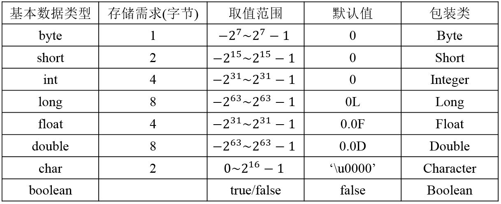

## 二、 基础语法

动态语言：运行时执行类型检查，如 PHP、Ruby、Python等
静态语言：编译时执行类型检查，如 C、C++、Java等

### 问：关键字和保留字

(1) Java关键字列表(依字母排序共50组)
	
	abstract, assert, boolean, break, byte, case, catch, char, class, const(保留关键字), continue, default, do, double, else, enum, extends, 
	final, finally, float, for, goto(保留关键字), if, implements, import, instanceof, int, interface, long, native, new, package, private, 
	protected, public, return, short, static, strictfp, super, switch, synchronized, this, throw, throws, transient, try, void, volatile, while 

(2) 保留字列表(依字母排序共14组)，Java保留字是指现有Java版本尚未使用，但以后版本可能会作为关键字使用 
  
	byValue, cast, false, future, generic, inner, operator, outer, rest, true, var, goto(保留关键字), const(保留关键字), null

注意：

(1) const和goto既是保留字又是关键字

(2) 除了const和goto，其余保留字和关键字是严格区分开的。

### 问：Java支持的数据类型有哪些？

Java语言支持的8种基本数据类型是：byte、short、int、long、float、double、boolean、char。

> Java中整数默认为int型，如果要指定整数为long型需要加L；浮点数默认为double型，如果要指定浮点数为float型需要加F。
> 
> Java中在定义类的成员变量时可以对其初始化，如果不对其初始化，Java使用默认值对其初始化；而局部变量在使用前则必须进行初始化，JVM不会进行默认值初始化。
> 
> Java中基本数据类型变量默认初始化值如表所示，对象引用默认初始化值为null。

图 2

案例：

	float f=3.4;  //错误，3.4默认为double型。
	float f=3.4F; //正确
	float f=3;    //正确

### 问：Java中的中文字符

Java语言中，中文字符所占的字节数取决于字符的编码方式，默认使用GBK编码方式。
	
	当采用ISO8859-1编码方式时，一个中文字符占1个字节；
	
	当采用GB2312或GBK编码方式时，一个中文字符占2个字节；
	
	当采用UTF-8编码方式时，一个中文字符会占3个字节。

Java字符默认使用unicode编码，每个字符占用两个字节，所以char型变量可以存放一个中文字符。

> Unicode字符编码标准是固定长度的字符编码方案。Unicode根据要编码的数据类型使用两种编码格式：8 位和16位。缺省编码格式是16位，即每个字符是16位(两个字节)宽。

注意：char与byte在Java和C++中的区别：
> 在C++中，char是基础数据类型，占1个字节；byte不是基础数据类型，一般定义为typedef unsigned char byte;也就是说，byte其实是unsigned char类型，那么也是占1个字节。不同的是，char可以表示的范围是-128-127，而byte可以表示的范围是0-255。
> 
> 在java中，char和byte都是基础数据类型，其中的byte占1个字节，可以表示的范围是-128-127。而char占2个字节，可以表示的范围是'\u0000'-'\uFFFF'。

### 问：Java字符集编码(Character set encoding)和国际化(i18n)问题

https://www.nowcoder.com/profile/7404313/test/8070641/3412?onlyWrong=0

### 问：类型转换

(1) byte<char<short<int<long<float<double

(2) 低级向高级是隐式类型转换，高级向低级必须强制类型转换

(3) Java中如果碰到char、byte和short参与运算时，会自动将这些值转换为int类型然后再进行运算。

案例：

	short s1 = 1; 
	s1 = s1 + 1; //错误，s1+1运算结果是int型，需要强制转换类型

	short s1 = 1; 
	s1 += 1;    //正确

https://www.nowcoder.com/questionTerminal/4cefb62973b149478bedc0ebcdbfb160

https://www.nowcoder.com/profile/7404313/test/7932407/1446#summary

两个数值进行二元操作时，会有如下的转换操作：
 
(1) 如果两个操作数其中有一个是double类型，另一个操作就会转换为double类型。 

(2) 否则，如果其中一个操作数是float类型，另一个将会转换为float类型。 

(3) 否则，如果其中一个操作数是long类型，另一个会转换为long类型。 
 
(4) 否则，两个操作数都转换为int类型。

案例：

	public static void main(String[] args){
	        int i=42;
	        double d=42.0000;
	        long l=42;
	        float f=42.0f;
	        float f2=42.00f;
	        System.out.println(d==i);   //true
	        System.out.println(f==i);   //true
	        System.out.println(f==f2);  //true
	        System.out.println(l==i);   //true
	        System.out.println(d==f);   //true
	    }

https://www.nowcoder.com/profile/7404313/test/7993658/25900?onlyWrong=0

https://www.nowcoder.com/profile/7404313/test/8004321/25817?onlyWrong=0

### 问：常见的运算符 +，%，~，三目运算符，++，&&和&，>>和>>>

- +：

案例：

	public class Test {
		public static void main(String args[]) {
			System.out.println(8+8+"88"+8+8);  //168888
		}
	}

https://www.nowcoder.com/profile/7404313/test/7958772/56865?onlyWrong=0

- %：取模运算符，要求操作数为整型。

- ~：按位取反运算符

案例：
	
	若int j = 10; 则~j为多少？

	计算机是用补码进行存储和计算的，因此10在计算机中补码存储为：00000000 00000000 00000000 00001010
	~j操作是对j的补码取反，然后得到结果即为~j的补码：         11111111 11111111 11111111 11110101
	现在通过~j的补码反推出~j的原码，~j最高位符号位为1，表明它是一个负数
	保持符号位不变，补码减1，得到~j的反码：                  11111111 11111111 11111111 11110100
	保持符号位不变，反码取反，得到~j的原码：                 10000000 00000000 00000000 00001011
	换算为整数，~j大小为-11

- 三目运算符

案例：
	
	boolean b=true?false:true==true?false:true;
	System.out.println(b);  //false

https://www.nowcoder.com/profile/7404313/test/7964595/36740?onlyWrong=0

- ++

https://www.nowcoder.com/profile/7404313/test/8049404/14765?onlyWrong=0

https://www.nowcoder.com/profile/7404313/test/8049404/15318?onlyWrong=0

https://www.nowcoder.com/profile/7404313/test/8070641/16022?onlyWrong=0

https://www.nowcoder.com/profile/7404313/test/8073949/56289?onlyWrong=0

- &&和&

&&:短路与，若该运算符左边为false，运算符右边表达式不执行。

&: 按位与，若该运算符左边为false，运算符右边表达式还会继续执行。

- >>和>>>

\>> 表示带符号右移

\>>> 表示无符号右移，左边空出的位以0填充

	int x=5>>2;  // >>表示带符号右移，5>>2相当于5除于2的平方，等于1
	int y=1>>>2; // >>>表示无符号右移，高位用0填充，0001右移两位为0000，等于0

### 进制

- 八进制： 012
- 十六进制：0x12

### 问：源码、反码和补码

例1：

	来源：https://www.nowcoder.com/questionTerminal/c4b42ebc2e4b44f693b3a8372e7c1ee1

	变量a是一个64位有符号的整数，初始值用16进制表示为：0Xf000000000000000；
	变量b是一个64位有符号的整数，初始值用16进制表示为：0x7FFFFFFFFFFFFFFF。
	则a-b的结果用10进制表示为多少？

	计算机是用补码进行存储和计算的，因此a和b的初始值即为a和b在计算机中的补码形式，即：a的补码为0Xf000000000000000，b的补码为0x7FFFFFFFFFFFFFFF
	0Xf000000000000000=1111 0000 0000 0000 0000 0000 0000 0000 0000 0000 0000 0000 0000 0000 0000 0000
	0x7FFFFFFFFFFFFFFF=0111 1111 1111 1111 1111 1111 1111 1111 1111 1111 1111 1111 1111 1111 1111 1111

	a-b=a+(-b)
	由于b是正数，原码与其补码相同，都为0x7FFFFFFFFFFFFFFF，则-b的原码为0xFFFFFFFFFFFFFFFF，是负数
	现在求-b的补码，先对它的原码(除符号位外)各位取反得到-b的反码，然后反码尾部加1得到-b的补码，为
	1000 0000 0000 0000 0000 0000 0000 0000 0000 0000 0000 0000 0000 0000 0000 0001

	所以a-b=a+(-b)=
	 1111 0000 0000 0000 0000 0000 0000 0000 0000 0000 0000 0000 0000 0000 0000 0000+
	 1000 0000 0000 0000 0000 0000 0000 0000 0000 0000 0000 0000 0000 0000 0000 0001=
    10111 0000 0000 0000 0000 0000 0000 0000 0000 0000 0000 0000 0000 0000 0000 0001(最高位溢出，舍去，结果变成了正数)
	则结果为0111 0000 0000 0000 0000 0000 0000 0000 0000 0000 0000 0000 0000 0000 0000 0001=2^62+2^61+2^60+1
 
例2：

	来源：https://www.nowcoder.com/profile/7404313/test/7977669/55201

	变量a是一个64位有符号的整数，初始值用16进制表示为：0x7FFFFFFFFFFFFFFF;
	变量b是一个64位有符号的整数，初始值用16进制表示为：0x8000000000000000。
	则a+b的结果用10进制表示为多少？

	计算机中是以补码形式存储数据，则a和b的初始值即为a和b在计算机中的补码形式。
	0x7FFFFFFFFFFFFFFF+0x8000000000000000=0xFFFFFFFFFFFFFFFF
	结果最高位符号位为1，说明结果为负数，现在求结果的原码值。
	保持符号位不变，补码减1，得到结果的反码；保持符号位不变，反码取反，得到结果的原码：-1

### 问：switch

switch(expr)中，expr是一个整数表达式，因此传递给switch和case语句的参数应该是int、short、char、byte或者其对应的封装类以及Enum类型，long、String(在Java7中，也支持了String类型)都不能用于swtich表达式。

在switch语句中，表达式的值不能是null，否则会在运行时抛出NullPointerException。在case子句中也不能使用null，否则会出现编译错误。

（这一点总结进去）https://www.nowcoder.com/profile/7404313/test/8066549/22459?onlyWrong=0

### 问：在JAVA中，如何跳出当前的多重嵌套循环？

使用break或return关键字，程序可以跳出当前的多重嵌套循环。

### 枚举类型

https://www.nowcoder.com/profile/7404313/test/8016183/7688?onlyWrong=0

