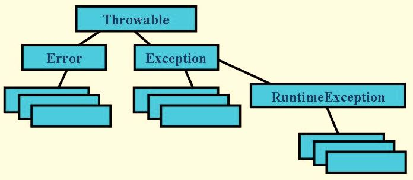

## 四、 异常处理

### 问：Java中的两种异常类型是什么？他们有什么区别？

Throwable包含了错误(Error)和异常(Excetion)两类。

图 1

(1) Error： 由Java虚拟机生成并抛出，属于JVM底层或者运行时环境的错误，程序无法预测和捕获处理，如OutOfMemoryError，如果出现Error，Java虚拟机会终止执行。

(2) Exception: 用户程序可以捕获的异常情况，Java中有两种异常，分别为运行时异常(RuntimeException, 又叫非检查异常)和非运行时异常(又叫检查异常)。

- **运行时异常**：RuntimeException类及其子类，如ArithmeticException、NullPointerException、IndexOutOfBoundsException、ClassCastException、BufferOverflowException、ConcurrentModificationException、IllegalArgumentException、NoSuchElementException、UnsupportedOperationException等，这类异常是在程序运行的时候可能会发生的，Java编译器不去检查它，也就是说，当程序中可能出现这类异常时，即使没有用try...catch语句捕获它，也没有用throws字句声明抛出它，还是会编译通过。所以程序可以捕捉，也可以不捕捉。这些异常一般是由程序的逻辑错误引起的，其产生频繁，处理麻烦，若显示申明或者捕获将会对程序的可读性和运行效率影响很大，建议不要用try...catch...捕获处理，程序应该在开发调试的过程中从逻辑角度去尽量避免，例如：空值处理。
 
- **非运行时异常**：运行时异常以外的异常，也是Exception及其子类，这些异常从程序的角度来说是必须经过捕捉检查处理的(要么用 try...catch捕获处理，要么用throws语句声明抛出)，否则不能通过编译。如IOException、SQLException、NoSuchMetodException、ClassNotFoundException、FileNotFoundException等。

### 问：异常处理语句的语法规则

(1) try代码块中包含可能产生异常的代码，其后跟一个或多个catch代码块，每个catch代码块用于捕获并处理一种特定类型的异常。

(2) 当try代码块中产生异常时，程序会终止当前的执行流程，Java虚拟机会把实际抛出的异常对象依次和各个catch代码块声明的异常类型匹配，如果异常对象为某个异常类型或其子类的实例，就执行这个catch代码块，然后其他的catch代码块将不会再执行，即一个异常只能被一个catch代码块捕获执行。如果catch代码块没有异常产生，所有的catch代码块将跳过不执行。

(5) catch代码块后可以跟finally代码块，无论try代码块中是否抛出异常，finally代码块都会被执行，因此finally代码块为异常处理提供一个统一的出口，使得在控制流程跳转到程序的其他部分之前，能够对程序的状态作统一的管理。通常在finally代码块中可以进行资源的清除工作。

(4) try代码块后基类异常的捕获语句不可以写在子类异常捕获语句的上面。

(5) 在try-catch-finally结构中，可重新抛出异常。 

(6) try-catch-finally结构可嵌套。 

(7) 自定义异常要继承Exception或Exception的子类。

### 问：异常处理完成以后，Exception对象会发生什么变化？

Exception对象会在下一个垃圾回收过程中被回收掉。

### 问：throw和throws有什么区别？

- throw关键字用来**在方法内部**明确地抛出异常，后面跟的是要抛出的**异常对象**且只能跟一个异常对象；

- throws关键字用**在声明方法上**，表示该方法可能要抛出的、该方法不能处理的异常，后面跟的是**异常类名**，可以有多个，用逗号隔开，这样方法的调用者才能够确保处理可能发生的异常。

### 问：finally

finally作为异常处理的一部分，只能用在try/catch语句块后，无论是否抛出异常，finally代码块都会执行，它主要是用来释放应用占用的资源。

实例1：当程序执行到try{}语句中的return方法时，它将要返回的结果存储到一个临时栈中，然后程序不会立即返回，而是去执行finally{}中的代码，在执行`a = 2`时，程序仅仅是覆盖了a的值，但不会去更新临时栈中的那个要返回的值。finally{}执行完之后，程序就会将临时栈中的值取出来返回。

	public abstract class Test {
	    public static void main(String[] args) {
	        System.out.println(beforeFinally());  // output: 1
	    }
	     
	    public static int beforeFinally(){
	        int a = 0;
	        try{
	            a = 1;
	            return a;
	        }finally{
	            a = 2;
	        }
	    }
	}
 
案例2：这里finally{}里也有一个return，那么在执行这个return时，就会更新临时栈中的值。同样，在执行完finally之后，程序将临时栈中的值取出来返回，即返回值是2.

	public abstract class Test {
	    public static void main(String[] args) {
	        System.out.println(beforeFinally());  //output: 2
	    }
	     
	    public static int beforeFinally(){
	        int a = 0;
	        try{
	            a = 1;
	            return a;
	        }finally{
	            a = 2;
	            return a;
	        }
	    }
	}
 
案例3：try/catch可以捕获并处理异常，异常被捕获后程序可以继续向后执行

	public class Test {
		public static void main(String[] args) {
			try {
				int i = 100 / 0;
				System.out.print(i);
			} catch (Exception e) {
				System.out.print(1);
			} finally {
				System.out.print(2);
			}
			System.out.print(3);
		}
	}
	// output: 123

 
案例4：catch语句块里面，打印完1之后，又抛出了一个RuntimeException，程序并没有处理它，而是直接抛出，因此执行完finally语句块之后，程序便不往下执行直接终止了

	public class Test {
		public static void main(String[] args) {
			try {
				int i = 100 / 0;
				System.out.print(i);
			} catch (Exception e) {
				System.out.print(1);
				throw new RuntimeException();
			} finally {
				System.out.print(2);
			}
			System.out.print(3);
		}
	}
	// output: 12

案例5：catch语句块里面，打印完1之后，程序先执行完finally语句块，然后return。

	public class Test {
		public static void main(String[] args) {
			try {
				int i = 100 / 0;
				System.out.print(i);
			} catch (Exception e) {
				System.out.print(1);
				return;
			} finally {
				System.out.print(2);
			}
			System.out.print(3);
		}
	}
	// output: 12

### 问：final关键字、finally代码块和finalize()方法有什么区别？

- final关键字用于声明属性、方法和类，分别表示属性不可变、方法不可覆盖、类不可继承。

- finally作为异常处理的一部分，只能用在try/catch语句块后，无论是否抛出异常，finally代码块都会执行，它主要是用来释放应用占用的资源。

- finalize()方法是Object类的一个protected方法，它是在对象被垃圾回收之前由垃圾收集器来调用的。可以覆盖此方法在垃圾收集时的进行其他资源回收，例如关闭文件等。