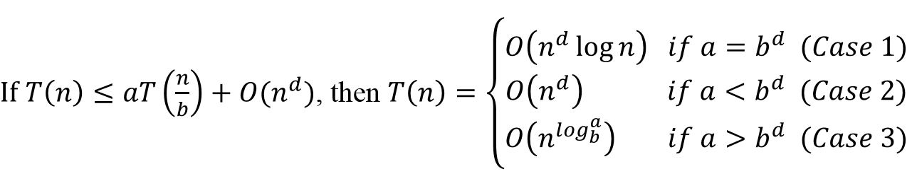
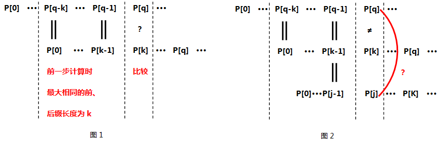

## 一、绪论

### 问：数据项、数据元素、数据对象、数据(无聊的题目，了解)

(1) 数据元素是数据的基本单位。一个数据元素可由若干个数据项组成，数据项是构成数据元素的不可分割的最小单位。

例如，学生记录就是一个数据元素，它由学号、姓名、性别等数据项组成。

(2) 数据对象是具有相同性质的数据元素的集合，是数据的一个子集。

### 问：抽象数据类型(了解)

一个数学模型以及定义在此模型上的一组操作。抽象数据类型的定义仅取决于它的一组逻辑特性，而与其在计算机内部如何表示和实现无关。通常用(数据对象、数据关系和基本操作)三元组来表示抽象数据类型。

### 问：数据结构的三要素：逻辑结构、存储结构和数据的运算。

### 问：数据的逻辑结构与存储结构

逻辑结构：指是数据元素之间的逻辑关系，通常分为线性结构和非线性结构。

存储结构：也称为物理结构，指数据结构在计算机中的表示，也称为存储结构，通常分为顺序结构，链式结构，索引结构，哈希结构。

### 问：线性结构与非线性结构

线性结构与非线性结构，主要看元素之间的关系，如果是一对一的关系则是线性表，如果不是一对一的关系则是非线性表。

数据结构中线性结构指的是数据元素之间存在着“一对一”的线性关系的数据结构。常用的线性结构有：线性表，栈，队列，双队列，数组，串。

线性结构是一个数据元素的有序（次序）集合。它有四个基本特征：

(1) 集合中必存在唯一的一个"第一个元素"；

(2) 集合中必存在唯一的一个"最后的元素"；

(3) 除最后元素之外，其它数据元素均有唯一的"后继"；

(4) 除第一元素之外，其它数据元素均有唯一的"前驱"。

相对应于线性结构，非线性结构的逻辑特征是一个结点元素可能对应多个直接前驱和多个直接后继。如树，广义表，图，多维数组等

### 问：顺序存储结构和链式存储结构

顺序存储结构的主要特点：

(1) 结点中只有自身的信息域，没有关联信息域。因此，顺序存储结构的存储密度大、存储空间利用率高。 

(2) 通过计算地址直接访问任何数据元素，即可以随机访问。
 
(3) 插入和删除操作会引起大量元素的移动。 

链式存储结构的主要特点是： 

(1) 结点除自身的信息域外，还有表示关联信息的指针域。因此，链式存储结构的存储密度小、存储空间利用率低。 

(2) 在逻辑上相邻的结点在物理上不必相邻，因此，不可以随机存取，只能顺序存取。 

(3) 插入和删除操作方便灵活，不必移动结点只需修改结点中的指针域即可。

### 问：广义表

如果广义表LS=(a1, a2, ..., an)非空，则a1是LS的表头，其余元素组成的表(a2,a3,..an)是称为LS的表尾，所以非空广义表尾一定是个表。

案例：
	https://www.nowcoder.com/profile/7404313/test/8016589/25564?onlyWrong=0

	https://www.nowcoder.com/profile/7404313/test/8073440/7459?onlyWrong=0

### 问：算法的5个基本特征

有穷性、确定性、可行性、输入、输出。

### 问：主定理

图 1

## 二、线性表

### 问：静态链表

用数组描述线性表的链式存储结构，即称为静态链表，它的节点有数据域和指针域，指针是节点的相对地址(数组下标)。

## 三、栈和队列

### 栈

https://www.nowcoder.com/profile/7404313/test/7993925/26203?onlyWrong=0

### 问：循环队列
元素个数=(尾指针-头指针+容量)%容量

https://www.nowcoder.com/profile/7404313/test/7965249/58100?onlyWrong=0

https://www.nowcoder.com/profile/7404313/test/8046479/58117?onlyWrong=0

https://www.nowcoder.com/profile/7404313/test/8046479/36305?onlyWrong=0

https://www.nowcoder.com/profile/7404313/test/8049952/14999?onlyWrong=0

https://www.nowcoder.com/profile/7404313/test/8073682/122?onlyWrong=0

https://www.nowcoder.com/profile/7404313/test/8067207/58065

### 问：算术表达式的中缀表达式、前缀表达式和后缀表达式

表达式一般由操作数、运算符组成，例如算术表达式中，通常把运算符放在两个操作数的中间，这称为中缀表达式，如A+B。波兰数学家Jan Lukasiewicz提出了另一种数学表示法，它有两种表示形式：把运算符写在操作数之前，称为波兰表达式或前缀表达式，如+AB；把运算符写在操作数之后，称为逆波兰表达式或后缀表达式，如AB+。

**将中缀表达式转换成后缀表达式的算法**：

https://www.nowcoder.com/profile/7404313/test/7915960/15226?onlyWrong=0

https://www.nowcoder.com/profile/7404313/test/7916777/52542?onlyWrong=0

https://www.nowcoder.com/profile/7404313/test/8004500/52324?onlyWrong=0

https://www.nowcoder.com/profile/7404313/test/8067207/111?onlyWrong=0

https://www.nowcoder.com/profile/7404313/test/8067207/52542?onlyWrong=0

**逆波兰表达式求值算法**：

1、循环扫描语法单元的项目。

2、如果扫描的项目是操作数，则将其压入操作数堆栈，并扫描下一个项目。

3、如果扫描的项目是一个二元运算符，则对栈的顶上两个操作数执行该运算。

4、如果扫描的项目是一个一元运算符，则对栈的最顶上操作数执行该运算。

5、将运算结果重新压入堆栈。

6、重复步骤2-5，堆栈中即为结果值。

**案例**：
	
	中缀表达式：a+b*c-(d+e)

	(1) 中缀表达式转换为前缀表达式：
	
	第一步：按照运算符的优先级对所有的运算单位加括号，算术表达式变成： ((a+(b*c))-(d+e)) 
	
	第二步：把每个运算符号移动到其对应的括号前面，则算术表达式变成了： -( +(a *(bc)) +(de)) 
	
	第三部：去掉括号得到前缀表达式： -+a*bc+de
	 
	(2) 中缀表达式转换为后缀表达式： 
	
	第一步：按照运算符的优先级对所有的运算单位加括号，算术表达式变成： ((a+(b*c))-(d+e)) 
	
	第二步：把每个运算符号移动到其对应的括号后面，则算术表达式变成了： ((a(bc)* )+ (de)+ )-  
	
	第三部：去掉括号得到后缀表达式： abc*+de+-

## 四、树与二叉树

### 问：平衡二叉树是平衡二叉排序树

### 问：完全二叉树的几个性质
(1) 完全二叉树中，编号为i的结点，其父节点为[i/2]（向下取整）。 

(2) 完全二叉树中，编号为i的结点，有如下四个性质（1<=i<=n，n为结点个数） 

- 判断编号为i的结点是叶子结点，还是分支结点：若2*i<=n，则结点i为分支结点，否则为叶子结点。 
- 分支结点的左右孩子情况，以及最大分支结点编号
	
	若n为奇数，则所有分支结点都有左右孩子。 
	
	若n为偶数，则编号为[n/2]（向下取整）的结点，只有左孩子，没有右孩子；其余分支结点左右孩子都有。

	最大分支结点编号都是[n/2]（向下取整）。

- 编号为i的结点如果有左孩子，则左孩子编号为2i；如果有右孩子，则右孩子的编号为2i+1
- 编号为i的结点的父结点编号为[i/2]（向下取整）（根节点除外）

### 问：二叉树在线索化后,仍不能有效求解的问题

后序线索二叉树中求后序后继(王道数据结构118页27题)

### 问：红黑树

https://www.nowcoder.com/profile/7404313/test/8078255/25631?onlyWrong=0

### 问：森林与二叉树

**树转换成二叉树的步骤**：

**森林转换成二叉树的步骤**： 

(1) 先把森林中的每棵树转换成二叉树 

(2) 第一颗二叉树不动，从第二颗二叉树开始，依次把后一颗二叉树的根结点作为前一颗二叉树的根结点的右孩子结点，用线连起来。当所有的二叉树连接起来后得到的二叉树就是由森林转换得到的二叉树。

**注意**：

(1) 将森林F转换为对应的二叉树T，F中叶结点的个数等于T中左孩子指针为空的结点个数。

在二叉树中，节点的左指针指向其孩子，节点的右指针指向其兄弟。在一颗二叉树中，如果某个节点的左指针为NULL，就说明这个节点在原来的森林中没有孩子，是叶子节点；如果某个节点的右指针为NULL，就说明这个节点在原来的森林中没有兄弟。 所以森林中的叶子节点=二叉树中左指针为NULL的个数。

### 问：将森林F转换为对应的二叉树T，F中叶结点的个数等于T中左孩子指针为空的结点个数

https://www.nowcoder.com/profile/7404313/test/8046479/52545?onlyWrong=0

### 问：树和森林的遍历与二叉树遍历的对应关系

图 1

## 五、图

### 问：顶点的度

有向图中，所有顶点的入度之和等于所有顶点的出度之和

### 问：连通图与强连通图，连通分量与强连通分量

在无向图中，如果从顶点v到顶点w有路径存在，则称v和w连通的。如果图中任意两个顶点之间都连通，则称该图为**连通图**，否则，称该图为非连通图。无向图的极大连通子图称为**连通分量。**

在有向图中，如果从顶点v到顶点w和从顶点w到顶点v之间都有路径存在，则称v和w是强连通的。如果图中任意两个顶点之间都是强连通的，则称该图为**强连通图**。有向图的极大连通子图称为**强连通分量。**

### 问：十字链表

十字链表(Orthogonal List)是**有向图**的另一种链式存储结构。该结构可以看成是将有向图的邻接表和逆邻接表结合起来得到的。

https://www.nowcoder.com/profile/7404313/test/8078823/4677?onlyWrong=0

### 问：几种算法的时间复杂度

(1) Prim算法

(2) Kruskal算法

(3) Dijkstra算法

(4) Floyd算法

(5) 拓扑排序

https://www.nowcoder.com/profile/7404313/test/8078255/334?onlyWrong=0

### 问：拓扑排序

https://www.nowcoder.com/profile/7404313/test/8049952/15329?onlyWrong=0

### 问：AOV网和AOE网

如果用有向无环图表示一个工程，其定点表示活动，用有向边<Vi, Vj>表示活动Vi必须先于Vj进行的一种关系，则将这种有向图称为表示活动的网络，简称AOV网。

在带权有向图中，以定点表示事件，有向边表示活动，边上的权值表示完成该活动的开销(如完成活动所需要的时间)，则称这种有向图为用边表示活动的网络，简称为AOE网。

### 问：关键路径

在AOE网中，从源点到汇点的所有路径中，具有最大路径长度的路径称为关键路径。

在AOE网中，可以有不止一条的关键路径。

**关键路径的计算步骤**

### 问：可以判断出一个有向图是否有环的算法

(1) 深度优先遍历
 
(2) 拓扑排序 

## 六、查找

### 问：折半查找的条件

数据有序、顺序存储

(如果数据存储在链式结构的链表中同样可以采用跳表完成二分法查找)

### 问：分块查找

分块查找的平均查找长度为索引查找和块内查找的平均长度之和，设索引查找和块内查找的平均查找长度分别为Li和Ls，则分块查找的平均查找长度为ASL=Li+Ls。

### 问：B树与B+树的区别

**(1) B树是一棵多路搜索树**。一棵m阶B树或为空树，或为满足如下特性的m叉树：

- 树中每个节点之多有m棵子树(即最多有m-1个关键字)
- 若根节点不是叶节点，则至少有两棵子树
- 除根节点以外的所有非叶节点至少有[m/2]棵子树(即至少含有[m/2]-1个关键字)。([]为(上取整))
- 所有非叶节点的关键字为K[1]，K[2]，…，K[n-1]且K[i]<K[i+1]；指向子树的指针为P[1]，P[2]，…，P[M]，其中P[0]指向关键字小于K[1]   的子树，P[n]指向关键字大于K[n]的子树，其它P[i]指向关键字属于(K[i], K[i+1])的子树
- 所有的叶节点都出现在同一层上，并且不带信息

**(2) B+树**

**(3) B树与B+树的区别**

B树只能进行索引查找，B+树既能顺序查找，也能索引查找

### 问：哈夫曼树(最优二叉树)

https://www.nowcoder.com/profile/7404313/test/8049952/52373?onlyWrong=0

### 问：Hash的冲突处理

https://www.nowcoder.com/profile/7404313/test/8046479/2962#summary

https://www.nowcoder.com/profile/7404313/test/8046479/56064?onlyWrong=0

### 问：KMP算法

(1) 先了解使用KMP算法进行字符串匹配的过程

	http://www.ruanyifeng.com/blog/2013/05/Knuth%E2%80%93Morris%E2%80%93Pratt_algorithm.html

KMP算法的最大特点在于：当一趟匹配过程中出现字符不匹配时，不需回溯主串指针，而是利用已经得到的"部分匹配"结果将模式串向右"滑动"尽可能远的一段距离后，继续进行比较，从而提高匹配效率。

(2) <a href="./Data-Structure-Algorithm-Pic/KMP.cpp" title="Title">KMP算法代码</a>

	
	#include<iostream>
	#include<vector>
	using namespace std;
	
	void computeNext(string pattern, vector<int>& next){
		int len=pattern.size();
		next.push_back(0);
		int matchLength=0;
		for(int q=1; q<len; q++){
			while(matchLength>0 && pattern[q]!=pattern[matchLength]){
				matchLength=next[matchLength-1];
			}
			if(pattern[q]==pattern[matchLength]){
				matchLength++;
			}
			next.push_back(matchLength);
		}
	}
	
	int kmp(string str, string pattern){
		vector<int> next;
		computeNext(pattern, next);
		int m=str.size();
		int n=pattern.size();
		for(int i=0, matchLength=0; i<m; i++){
			while(matchLength>0 && str[i]!=pattern[matchLength]){
				matchLength=next[matchLength-1];
			}
			if(str[i]==pattern[matchLength]){
				matchLength++;
			}
			if(matchLength==n)
				return i-n+1;
		}
		return -1;
	}
	
	int main(){
		string str="BBC ABCDAB ABCDABCDABDE";
		string pattern="ABCDABD";
		cout<<kmp(str, pattern)<<endl;
		return 0;
	}

(3) next数组求解，本质上在求模式串每一位的最大相同前后缀的长度

	来源：http://www.cnblogs.com/c-cloud/p/3224788.html

	void computeNext(string pattern, vector<int>& next){
		int len=pattern.size();
		next.push_back(0);   //模式串P的第一个字符的最大相同前后缀长度为0
		int matchLength=0;   //当前已经求得的子串的最大相同前后缀长度
		for(int q=1; q<len; q++){  //从第二个字符开始，依次计算每一个字符对应的next值
			while(matchLength>0 && pattern[q]!=pattern[matchLength]){//while循环
				matchLength=next[matchLength-1];
			}
			if(pattern[q]==pattern[matchLength]){ //如果相等，那么最大相同前后缀长度加1
				matchLength++;
			}
			next.push_back(matchLength);
		}
	}

设有模式串P(代码中表示为pattern)，第一个字符的最大相同前后缀长度为0，即next[0]=0，现在准备求模式串P其他字符位对应的next数组值。

next数组求解最大的难点在于while循环，这里重点解释while循环所做的工作：	

(1) 假设当前已求得P[0, ..., q-1]的最大相同前后缀的长度为k(代码中表示为matchLength)，即next[q-1]=k。

(2) 现在求next[q]，即P[0, ..., q]的最大相同前后缀的长度。此时比较模式串P中字符位P[q]和字符位P[k]，如图1所示。

- 如果P[q]等于P[k]，那么很简单，P[0, ..., q]的最大相同前后缀的长度等于P[0, ..., q-1]的最大相同前后缀的长度加1，即next[q]=next[q-1]+1，继续求下一个位置的next值。
- 但如果P[q]不等于P[k]又该怎么办呢？这时我们可以利用已经得到的next[0, ..., k-1]，为什么呢？ 原因在于P[k]已经和P[q]失配了，而P[q-k, ..., q-1]又与P[0, ..., k-1]相同，那么在P[0]···P[k-1]这么长的子串用不了的情况下，我们能不能找到一个同样以P[0]开头、P[k-1]结尾且尽可能长的子串来和P[0, ..., q-1]匹配？这样的子串存在吗？当然是存在的，想一想P[0, ..., k-1]子串不是有最大相同前后缀吗？next[k-1]不就是P[0, ..., k-1]子串的最大相同前后缀的长度嘛！那么我们取这个子串为P[0, ..., k-1]的最大前缀不就可以了嘛，即P[0, ..., j-1] (j=next[k-1])，然后看它的下一项P[j]能否和P[q]匹配，如图2所示。

https://www.nowcoder.com/profile/7404313/test/7932813/25387?onlyWrong=0

https://www.nowcoder.com/profile/7404313/test/8016341/158?onlyWrong=0

https://www.nowcoder.com/profile/7404313/test/8066897/157?onlyWrong=0

https://www.nowcoder.com/profile/7404313/test/8066897/52595?onlyWrong=0

https://www.nowcoder.com/profile/7404313/test/8066897/25387?onlyWrong=0

https://www.nowcoder.com/profile/7404313/test/8073440/52595?onlyWrong=0

### 问：哈希表

(1) 构造哈希表时经常使用的哈希函数

- 直接定址法：取关键字或关键字的某个线性函数值为散列地址，即H(key)=key或H(key)=a·key+b，其中a和b为常数(这种散列函数叫做自身函数)
- 数字分析法
- 平方取中法
- 折叠法
- 除留余数法

(2) 冲突处理的方法

- 开放定址法：线性探测法、平方探测法、再散列法、伪随机序列法
- 拉链法

## 七、排序

### 问：各种内部排序算法性质

图 1

备注：这里的冒泡排序是指优化的冒泡排序。

注意：

(1) 若记录的初始状态已经按关键码基本有序，则选用直接插入排序或冒泡排序发为宜

(2) 在排序中关键字比较次数同记录初始排列次序无关的算法有：折半插入排序、选择排序、基数排序、

> 直接插入排序，在完全有序的情况下，每个元素只需要与它左边的元素比较一次就可以确定它的最终位置
>
> 快速排序，初始排序会影响划分次数。假设2n+1个数在一趟排序中被分为两部分，各为n个数，则下一趟排序中需要比较的次数为n-1+n-2=2n-2；假设分成的两部分分别有1个数和2n个数，则下一趟排序中需要比较的次数为2n-1。很明显初始排序会影响比较次数。
>
> 归并排序，假设在归并的时候，右路有n个元素，右路有n个元素，则一次归并最大比较次数为2n-1，最少比较次数为n，所以与初始排序有关。

https://www.nowcoder.com/profile/7404313/test/7993780/56526?onlyWrong=0

(3) 在排序中关键字移动次数同记录初始排列次序无关的算法有：

(4) 关键字初始排列顺序对算法的性能无影响的排序算法有：选择排序、(原始的)冒泡排序

https://www.nowcoder.com/profile/7404313/test/8078255/56526?onlyWrong=0

(5) 快速排序在被排序的数据基本无序的时候最易发挥其长处，时间复杂度为O(nlogn)；在已经有序或逆序的情况下效率最差，为O(n^2)。

(6) 快速排序是目前基于比较的内部排序中平均时间复杂度最好的排序方法

(7) 希尔排序，也称为递减增量排序算法，是插入排序的一种高速而稳定的改进版本。

希尔排序是基于插入排序的以下两点性质而提出改进方法的： 
> 插入排序在对几乎已经排好序的数据操作时，效率高，即可达到线性排序的效率；
> 
> 但插入排序一般来说是低效的，因为插入排序每次只能将数据移动一位；

(8) 堆排序建堆时间复杂度为O(n)，每次调整时间复杂度为O(h)

(9) (假设根节点序号为1)小根堆中最大的数一定在叶子节点上，堆本身是个完全二叉树，完全二叉树的叶子节点的位置大于[n/2]

(10) 对n个记录的线性表进行快速排序，为减少算法的递归深度，每次分区后,先处理较短的部分

https://www.nowcoder.com/profile/7404313/test/7977812/512?onlyWrong=0

(11)

https://www.nowcoder.com/profile/7404313/test/8004414/1003?onlyWrong=0 

https://www.nowcoder.com/profile/7404313/test/8066897/50969?onlyWrong=0

### 问：快速排序

https://www.nowcoder.com/profile/7404313/test/8078255/36512?onlyWrong=0

### 问：外部排序

https://www.nowcoder.com/profile/7404313/test/8073440/555

### 问：桶排序

### 问：从n个数里面找最大的一个数理论最少需要比较：n-1次

	https://www.nowcoder.com/profile/7404313/test/8049700/14705?onlyWrong=0
	这道题其实就是一种二叉树结构，1001个员工为叶节点，而比赛次数则是求非叶节点

### 问：从n个数里面找最大的两个数理论最少需要比较：n+logn-2次 （？？）

https://www.nowcoder.com/profile/7404313/test/7915960/1904#summary

https://www.nowcoder.com/profile/7404313/test/7993780/55647?onlyWrong=0

### 问：在n个数中选出最大的m个数(3<m<n)，时间复杂度最小为O(n)

http://blog.csdn.net/fisher_jiang/article/details/2473698

https://www.nowcoder.com/profile/7404313/test/7932813/499?onlyWrong=0

https://www.nowcoder.com/profile/7404313/test/8066897/44776?onlyWrong=0

https://www.nowcoder.com/profile/7404313/test/8073440/5771?onlyWrong=0

https://www.nowcoder.com/profile/7404313/test/8073682/55647?onlyWrong=0

https://www.nowcoder.com/profile/7404313/test/8078255/44776?onlyWrong=0

这一题蛮好的：

	https://www.nowcoder.com/profile/7404313/test/8049700/26008?onlyWrong=0

### 问：在N个乱序数字中查找第k大的数字(未整理，因为还不是特别清楚)

https://www.nowcoder.com/profile/7404313/test/7977812/2910

https://www.nowcoder.com/profile/7404313/test/8004500/2926?onlyWrong=0

### 问：求n个数中的最大值和最小值，最少的比较次数

https://www.nowcoder.com/profile/7404313/test/8046125/22266?onlyWrong=0

## 八、 其他

