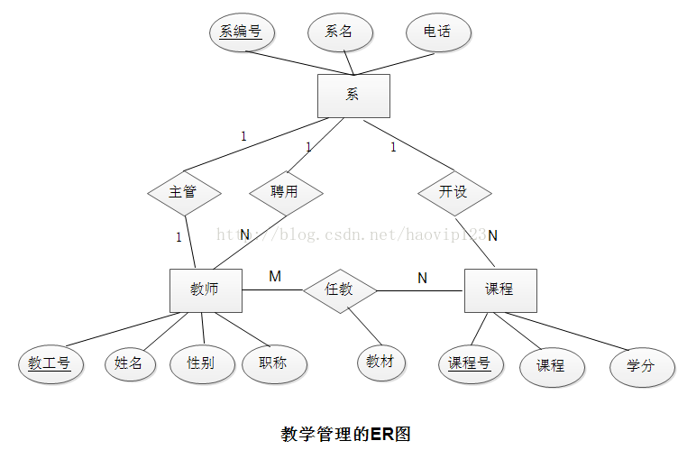

### 问：数据库管理系统的特点

共享性高，冗余度小；具有高度的物理独立性和逻辑独立性；整体结构化，用数据模型描述；由数据库管理系统提供数据安全性、完整性、并发控制和恢复能力。

### 问：ER模型

ER模型的基本元素是：实体、联系和属性

(1) 实体：是一个数据对象，指应用中可以区别的客观存在的事物。

(ER模型中的实体往往是指实体集)实体集：指同一类实体构成的实体集合，用方框表示表示，方框内注明实体的命名。

(2) 联系：表示一个或多个实体之间的关联关系。联系用菱形框表示，并用线段将其与相关的实体链接起来。

(3) 属性：实体的某一特性称为属性，属性用椭圆形框表示，加下划线的属性为标识符。

实例：教学管理的一个可能设计的ER图

图 1

### 问：非关系型数据库

NoSQL数据库的四大分类

(1) 键值(Key-Value)存储数据库

这一类数据库主要会使用到一个哈希表，这个表中有一个特定的键和一个指针指向特定的数据。Key/value模型对于IT系统来说的优势在于简单、易部署。但是如果DBA只对部分值进行查询或更新的时候，Key/value就显得效率低下了。

举例如：Tokyo Cabinet/Tyrant，Redis，Voldemort，Oracle BDB.，Google BigTable，Amazon DynamoDB

(2) 列存储数据库。

这部分数据库通常是用来应对分布式存储的海量数据。键仍然存在，但是它们的特点是指向了多个列。这些列是由列家族来安排的。

如：Cassandra，HBase，Riak.

(3) 文档型数据库

文档型数据库的灵感是来自于LotusNotes办公软件的，而且它同第一种键值存储相类似。该类型的数据模型是版本化的文档，半结构化的文档以特定的格式存储，比如JSON。文档型数据库可以看作是键值数据库的升级版，允许之间嵌套键值。而且文档型数据库比键值数据库的查询效率更高。

如：CouchDB, MongoDb。国内也有文档型数据库SequoiaDB，已经开源。

(4) 图形(Graph)数据库

图形结构的数据库同其他行列以及刚性结构的SQL数据库不同，它是使用灵活的图形模型，并且能够扩展到多个服务器上。NoSQL数据库没有标准的查询语言(SQL)，因此进行数据库查询需要制定数据模型。许多NoSQL数据库都有REST式的数据接口或者查询API。
  
如：Neo4J, InfoGrid, Infinite Graph.

因此，我们总结NoSQL数据库在以下的这几种情况下比较适用：

(1)数据模型比较简单；(2)需要灵活性更强的IT系统；(3)对数据库性能要求较高；(4)不需要高度的数据一致性；(5)对于给定key，比较容易映射复杂值的环境。

https://www.nowcoder.com/profile/7404313/test/7972569/55678?onlyWrong=0

### 问：完整性约束

https://www.nowcoder.com/profile/7404313/test/7956107/22372?onlyWrong=0

### 问：数据库表增删列

在表中添加列，请使用下列语法:ALTER TABLE tableName ADD column_name datatype (添加列必须说明数据类型)

在表中删除列，请使用下列语法:ALTER TABLE tableName DROP COLUMN column_name (删除列可以省略column)

###  问：查看Mysql表结构的命令

desc 表名;

show columns from 表名;

describe 表名;

show create table 表名;

use information_schema

select * from columns where table_name='表名';

### 问：从表TABLE_NAME中提取前10条记录

Sql server: select TOP N * from table_name. 

MySQL: select * from table_name limit 0,10; 

Oracle: select * from table_name where rownum＜=10

### 问：SQL的匹配模式

(1) %表示匹配0个或多个字符
	
	select * from user where name LIKE '%三%'; 
	将会把name为"张三"、"三脚猫"、"唐三藏"等等有"三"的全找出来。

	%三：表示左匹配； 三%：表示右匹配； %三%：表示模糊查询。

(2) _表示匹配单个任意字符
	
	select * from user where name LIKE '_三_'；
	只找出"唐三藏"这样name为三个字且中间一个字是"三"的； 

	select * from user where name LIKE '三__'； 
	只找出"三脚猫"这样name为三个字且第一个字是"三"的

(3) [ ]表示匹配括号内所列字符中的任意一个

	select * from user where name LIKE '[张李王]三'; 
	将找出"张三"、"李三"、"王三"(而不是"张李王三")； 

	如[]内有一系列字符（01234、abcde之类的)，则可略写为"0-4"、"a-e"。
	select * from user where name LIKE '老[1-9]'；
	将找出"老1"、"老2"、……、"老9"；
	如要找"-"字符，请将其放在首位：'张三[-1-9]'；

(4) [^ ]表示匹配不在括号所列字符内的单个任意字符
	
	select * from user where name LIKE '[^张李王]三';
	将找出不姓"张"、"李"、"王"的"赵三"、"孙三"等

	select * from user where name LIKE '老[^1-4]'; 
	将排除"老1"到"老4"，寻找"老5"、"老6"、"老9"、……

### 问：范式理论  未完善

https://www.nowcoder.com/profile/7404313/test/7907952/36223?onlyWrong=0

(1) 第一范式(1NF)

定义：如果关系模式R的每个关系r的属性都是不可分的数据项，那么就称R是第一范式的模式。 简单的说，每一个属性都是原子项，不可分割。

1NF是关系模式应具备的最起码的条件，如果数据库设计不能满足第一范式，就不称为关系型数据库。关系数据库设计研究的关系规范化是在1NF之上进行的。 

例如(学生信息表)： 

	学生编号　　 姓名　　性别　　              联系方式 
	20080901　　张三　　 男　　　email:zs@126.com,phone:88886666 
	20080902　　李四　　 女　　　email:ls@126.com,phone:66668888 

以上的表就不符合第一范式：联系方式字段可以再分，所以变更为正确的模式是： 

	学生编号　　 姓名　　性别　　   电子邮件　　　  电话 
	20080901　　张三　　 男　　　zs@126.com　　88886666 
	20080902　　李四　　 女　　　ls@126.com　　66668888 

(2) 第二范式(2NF)

定义：如果关系模式R是1NF，且每个非主键属性完全函数依赖于候选键，那么就称R是第二范式。 简单的说，第二范式要满足以下的条件：首先要满足第一范式，其次每个非主键属性要完全函数依赖于候选键，或者是主键。也就是说，每个非主属性是由整个主键函数决定的，而不能由主键的一部分来决定。 

例如(学生选课表):

	学生　　　　 课程　　　 教师　　　　教师职称　　      教材　　　　　　  教室　　上课时间
	李四　　　　Spring　　张老师　　　java讲师　　《Spring深入浅出》　　   301　   08:00
	张三　　　　Struts　　杨老师　　　java讲师　　《Struts in Action》　  302　   13:30

这里通过(学生，课程)可以确定教师、教师职称、教材、教室和上课时间，所以可以把(学生，课程)作为主键。但是，教材并不完全依赖于(学生，课程)，只拿出课程就可以确定教材，因为一个课程一定指定了某个教材。这就叫不完全依赖，或者部分依赖。出现这种情况，就不满足第二范式。 

修改后，选课表： 

	学生　　　　 课程　　　教师　　　　教师职称　　教室　　上课时间
	李四　　　　Spring　　张老师　　　java讲师　　301　   08:00
	张三　　　　Struts　　杨老师　　　java讲师　　302　   13:30

课程表： 

	课程　　　       教材 
	Spring　　《Spring深入浅出》 
	Struts　　《Struts in Action》 

所以，第二范式可以说是消除部分依赖。第二范式可以减少插入异常，删除异常和修改异常。

(3) 第三范式(3NF)

满足第三范式（3NF）必须先满足第二范式（2NF）。简而言之，第三范式（3NF）要求一个数据库表中不包含已在其它表中已包含的非主关键字信息。
例如，存在一个部门信息表，其中每个部门有部门编号（dept_id）、部门名称、部门简介等信息。那么员工信息表中列出部门编号后就不能再将部门名称、部门简介等与部门有关的信息再加入员工信息表中。

### 问：数据库事务的四大特性：

数据库事务是指作为单个逻辑工作单元执行的一系列操作，这些操作要么全做要么全不做，是一个不可分割的工作单位。

数据库事务的四大特性是：原子性、一致性、独立性和持久性，简称ACID。

(1) 原子性(Atomicity)

事务的原子性指的是，事务中包含的程序作为数据库的逻辑工作单位，它所做的对数据修改操作要么全部执行，要么完全不执行。这种特性称为原子性。

例如银行取款事务分为2个步骤(1)存折减款(2)提取现金。不可能存折减款，却没有提取现金。2个步骤必须同时完成或者都不完成。

(2)一致性(Consistency)   
 
事务的一致性指的是在一个事务执行之前和执行之后数据库都必须处于一致性状态。这种特性称为事务的一致性。假如数据库的状态满足所有的完整性约束，就说该数据库是一致的。

例如完整性约束a+b=10，一个事务改变了a，那么b也应随之改变。

(3)独立性(Isolation)

分离性指并发的事务是相互隔离的。即一个事务内部的操作及正在操作的数据必须封锁起来，不被其它企图进行修改的事务看到。假如并发交叉执行的事务没有任何控制，操纵相同的共享对象的多个并发事务的执行可能引起异常情况。

(4)持久性(Durability)

持久性意味着当系统或介质发生故障时，确保已提交事务的更新不能丢失。即一旦一个事务提交，DBMS保证它对数据库中数据的改变应该是永久性的，即对已提交事务的更新能恢复。持久性通过数据库备份和恢复来保证。

### 问：数据库事务隔离级别

数据库事务的隔离级别有4个，由低到高依次为Read uncommitted、Read committed、Repeatable read、Serializable，这四个级别可以逐个解决脏读、不可重复读、幻读这几类问题。

http://blog.csdn.net/fg2006/article/details/6937413

